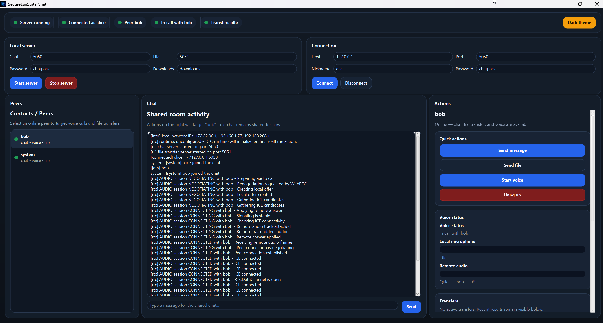

# Secure LAN Suite

Secure LAN Suite is a multi-module Gradle project for a secure LAN desktop application built with JavaFX.

## Tech stack
- Java 25 LTS
- Gradle 9.1+ recommended
- JavaFX 25.0.2
- `webrtc-java` for realtime data/audio/video transport
- `jpackage` for native packaging
- WiX 5.0.2 for Windows EXE installers

## Project structure

### Applications
- `apps/desktop-client` — JavaFX desktop client

### Modules
- `modules/common-model`
- `modules/common-net`
- `modules/crypto-core`
- `modules/chat-core`
- `modules/file-transfer-core`
- `modules/webrtc-core`
- `modules/audio-core`
- `modules/webcam-core`
- `modules/stego-core`

## Current product state

### Working now
- start a local secure chat server
- connect a client with encrypted chat handshake
- send and receive chat messages
- start a secure file transfer server automatically with the chat server
- send files from the desktop UI
- receive files into a configurable downloads directory
- route WebRTC-style signaling through `chat-core` into `webrtc-core`
- start `RTCDataChannel` sessions from the desktop UI
- start voice sessions backed by native `webrtc-java`
- monitor server, connection, peer, voice, and transfer state from the compact top status bar
- use the redesigned messenger-style desktop layout:
  - peer list on the left
  - chat/activity feed in the center
  - actions, voice status, transfers, and advanced tools on the right

### Current UI layout
The desktop client now uses a **messenger-style workspace** instead of the older tabbed layout.

- **Top status bar** — compact colored indicators for server, connection, selected peer, voice state, and file transfers
- **Left column** — peer list / contacts
- **Center column** — chat, system events, file events, and realtime messages
- **Right column** — quick actions, voice status, transfers, and advanced/experimental controls

### Realtime status
- `RTCDataChannel` is integrated and available from the desktop client
- voice sessions are the primary supported realtime flow
- video code paths still exist in `webrtc-core`, but video remains **experimental** and is hidden from the main UX until it becomes stable enough for normal use

## Screenshots



## Requirements
- JDK 25 installed
- Gradle 9.1 or newer recommended for Java 25
- Internet access on the first Gradle build so dependencies can be downloaded
- Windows only: WiX 5.0.2 installed and available in `PATH` for EXE packaging
- For WiX 5, the required extensions must also be installed:
  - `WixToolset.UI.wixext`
  - `WixToolset.Util.wixext`

## Verify the environment

```powershell
java --version
jpackage --version
wix --version
```

`wix --version` is only required when you build the Windows EXE installer.

## Build and run

Build the whole project:

```bash
./gradlew clean build
```

Run the desktop client:

```bash
./gradlew :apps:desktop-client:run
```

## Packaging

All packaging tasks live in `apps/desktop-client`.

### Portable build

Build a portable application image and ZIP archive:

```bash
./gradlew :apps:desktop-client:buildPortable
```

Example output:
- `apps/desktop-client/build/distributions/SecureLanSuite-<version>-portable.zip`

This task uses `jpackage --type app-image`, so it does not require WiX.

### Windows EXE installer

Build the Windows EXE installer:

```powershell
.\gradlew.bat :apps:desktop-client:buildExe
```

or directly:

```powershell
.\gradlew.bat :apps:desktop-client:createExe
```

Output directory:
- `apps/desktop-client/build/jpackage/`

Example output file:
- `apps/desktop-client/build/jpackage/SecureLanSuite-<version>.exe`

Notes:
- this task must be run on Windows
- `jpackage` must come from JDK 25
- WiX 5.0.2 must be installed and available in `PATH`
- WiX extensions `WixToolset.UI.wixext` and `WixToolset.Util.wixext` must be installed globally
- WiX 7 is **not recommended** for this project because the working `jpackage` setup was verified with WiX 5.0.2

### Inspect resolved packaging tools

```bash
./gradlew :apps:desktop-client:printPackagingEnvironment
```

This prints the resolved Java launcher, the `jpackage` executable used by the build, and whether WiX is visible in `PATH`.

## Installing WiX on Windows

Use the instructions in [`docs/wix-installation.md`](docs/wix-installation.md).

Short version:

```powershell
dotnet nuget add source https://api.nuget.org/v3/index.json -n nuget.org
dotnet tool install --global wix --version 5.0.2
wix extension add --global WixToolset.UI.wixext/5.0.2
wix extension add --global WixToolset.Util.wixext/5.0.2
wix extension list --global
wix --version
```

## Realtime architecture
- `chat-core` transports realtime signaling envelopes between peers
- `webrtc-core` owns realtime session state, signaling integration, diagnostics, and runtime/provider integration
- `webrtc-core` boots a native `webrtc-java` engine and reuses the secure chat path for SDP and ICE signaling
- `audio-core` and `webcam-core` expose default media profiles and UI/runtime hints for realtime sessions
- implementation notes: [`docs/webrtc-architecture.md`](docs/webrtc-architecture.md)

## File transfer notes
- chat uses the configured port, for example `5050`
- file transfer uses `chat port + 1`, for example `5051`
- file transfer handshake uses `crypto-core` with ephemeral RSA key exchange and AES-GCM transport encryption

## Current limitations
- true LAN peer discovery is not implemented yet
- key management and advanced transfer controls are not fully exposed in the desktop UI yet
- video is still experimental and is intentionally hidden from the main workflow
- device selection still defaults to the first/default available audio and camera devices
- EXE packaging is Windows-only because `jpackage` does not cross-build Windows installers
