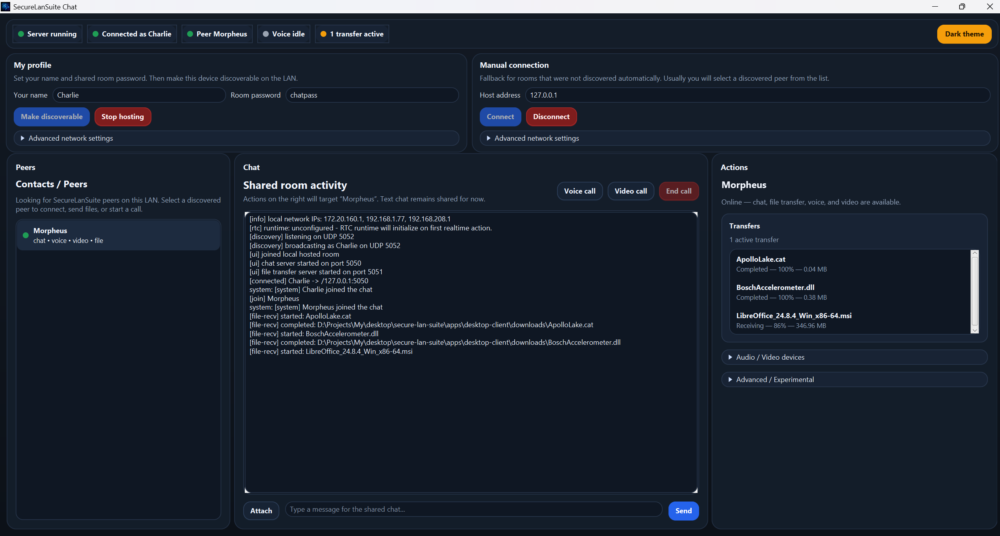

# Secure LAN Suite

Secure LAN Suite is a JavaFX desktop application for secure communication in a local network. The repository is a Gradle multi-module monorepo that keeps UI, networking, cryptography, file transfer, realtime media, and future feature modules separated.

## Tech stack
- Java 25
- Gradle 9.1+ recommended
- JavaFX 25.0.2
- `webrtc-java` 0.14.0 for realtime data, voice, and experimental video transport
- `jpackage` for native application images and installers
- WiX 5.0.2 for Windows EXE installers

## Project structure

### Applications
- `apps/desktop-client` — JavaFX desktop client and application packaging tasks

### Modules
- `modules/common-model` — shared DTO records, enums, app events, transfer models, RTC signaling models
- `modules/common-net` — shared network constants and common networking foundation
- `modules/crypto-core` — AES-GCM, RSA, hashing, signatures, key generation, file crypto workflows, keystore helpers
- `modules/chat-core` — secure chat server/client, handshake, message protocol, signaling transport, UDP peer discovery
- `modules/file-transfer-core` — encrypted file transfer client/server, secure handshake, progress events
- `modules/webrtc-core` — RTC session orchestration, WebRTC runtime/provider integration, data channels, voice, experimental video, diagnostics
- `modules/audio-core` — default audio profile hints used by desktop/realtime flows
- `modules/webcam-core` — default video profile hints used by desktop/realtime flows
- `modules/stego-core` — UI-free BMP steganography services for binary/text payload hide/extract workflows and password-based encrypt-then-hide flows

## Current product state

### Working now
- start and stop a local secure chat room
- automatically join the locally hosted room from the same desktop client
- connect manually to a remote room by host and port
- discover Secure LAN Suite peers on the LAN with UDP broadcast/listen mode
- control room visibility with the **Discoverable** checkbox
- connect to a discovered peer directly from the peer list
- complete an encrypted chat handshake using the shared room password
- send and receive chat messages in the shared room activity feed
- start a secure file-transfer listener together with the chat room or client connection
- send files from the desktop UI to a selected online peer
- receive files into a configurable downloads directory
- show transfer progress and transfer status in the main workspace
- route RTC signaling through `chat-core` into `webrtc-core`
- start `RTCDataChannel` sessions from the desktop UI
- start voice sessions backed by native `webrtc-java`
- choose detected microphone and camera capture devices for RTC sessions
- test microphone capture and open a camera preview window from the desktop UI
- start experimental 1-to-1 video calls with an inline video stage
- use the desktop steganography tools panel to hide/extract text payloads in uncompressed BMP images, including password-encrypted payloads through `stego-core`
- monitor server, connection, selected peer, voice, transfer, runtime, and diagnostics state from the compact UI
- use the messenger-style desktop layout:
  - peer list on the left
  - chat/activity feed and inline video stage in the center
  - actions, media status, transfers, and advanced tools on the right

### Current UI layout
The desktop client uses a **messenger-style workspace**.

- **Top status bar** — compact colored indicators for server, connection, selected peer, voice state, and file transfers
- **Header** — local profile/hosting controls and manual connection fallback
- **Left column** — discovered/chat peers and contact status
- **Center column** — optional inline video stage, chat messages, system events, file events, and realtime messages
- **Right column** — quick actions, voice/media status, transfers, RTC data tools, diagnostics, and advanced/experimental controls

### Realtime status
- `RTCDataChannel` is integrated and available from the desktop client
- voice sessions are the primary supported realtime media flow
- microphone and camera capture device selection is exposed in the desktop UI
- camera preview and 1-to-1 video calls are implemented but remain **experimental**
- local and remote video preview behavior can be controlled with JVM system properties:
  - `securelan.rtc.videoPreview.local.enabled`
  - `securelan.rtc.videoPreview.remote.enabled`

## Screenshots



## Requirements
- JDK 25 installed and active
- Gradle 9.1 or newer recommended for Java 25
- Internet access on the first Gradle build so dependencies can be downloaded
- Windows only: WiX 5.0.2 installed and available in `PATH` for EXE packaging
- For WiX 5, the required extensions must also be installed:
  - `WixToolset.UI.wixext`
  - `WixToolset.Util.wixext`

## Verify the environment

```powershell
java --version
jpackage --version
wix --version
```

`wix --version` is only required when you build the Windows EXE installer.

## Build and run

Build the whole project:

```bash
./gradlew clean build
```

Run the desktop client:

```bash
./gradlew :apps:desktop-client:run
```

On Windows, the same commands can be run with `gradlew.bat`:

```powershell
.\gradlew.bat clean build
.\gradlew.bat :apps:desktop-client:run
```

## Desktop workflow

1. Enter a nickname and shared room password.
2. Click **Open room** to host locally, or wait for discovered peers in the left column.
3. Keep **Discoverable** enabled if this room should be advertised through UDP discovery.
4. Select a discovered peer and click **Connect**, or use the manual host/port fields as a fallback.
5. Exchange chat messages in the center feed.
6. Use right-side quick actions to send files, start a voice call, start an experimental video call, or end an active call.

Default ports:
- chat: `5050`
- encrypted file transfer: `5051`
- UDP discovery: `5052`

## Packaging

All packaging tasks live in `apps/desktop-client`.

### Portable build

Build a portable application image and ZIP archive:

```bash
./gradlew :apps:desktop-client:buildPortable
```

Example output:
- `apps/desktop-client/build/distributions/SecureLanSuite-<version>-portable.zip`

The intermediate application image is created under:
- `apps/desktop-client/build/packaging/SecureLanSuite/`

This task uses `jpackage --type app-image`, so it does not require WiX.

### Windows EXE installer

Build the Windows EXE installer:

```powershell
.\gradlew.bat :apps:desktop-client:buildExe
```

or directly:

```powershell
.\gradlew.bat :apps:desktop-client:createExe
```

Output directory:
- `apps/desktop-client/build/packaging/`

Example output file:
- `apps/desktop-client/build/packaging/SecureLanSuite-<version>.exe`

Notes:
- this task must be run on Windows
- `jpackage` must come from JDK 25
- WiX 5.0.2 must be installed and available in `PATH`
- WiX extensions `WixToolset.UI.wixext` and `WixToolset.Util.wixext` must be installed globally
- WiX 7 is **not recommended** for this project because the working `jpackage` setup was verified with WiX 5.0.2

## Installing WiX on Windows

Use the instructions in [`docs/wix-installation.md`](docs/wix-installation.md).

Short version:

```powershell
dotnet nuget add source https://api.nuget.org/v3/index.json -n nuget.org
dotnet tool install --global wix --version 5.0.2
wix extension add --global WixToolset.UI.wixext/5.0.2
wix extension add --global WixToolset.Util.wixext/5.0.2
wix extension list --global
wix --version
```

## Architecture notes

### Chat and discovery
- `chat-core` provides the secure room server/client, shared message protocol, and secure handshake integration
- `chat-core` also provides UDP broadcast/listen peer discovery through `PeerDiscoveryService`
- `desktop-client` starts discovery in listen-only mode by default and broadcasts when a hosted room is discoverable
- discovered peers are shown in the left peer list and can populate manual connection fields automatically

### File transfer
- chat uses the configured chat port, for example `5050`
- file transfer uses a separate configured port, commonly `5051`
- file transfer uses `crypto-core` with an ephemeral RSA key exchange and AES-GCM encrypted payload chunks
- transfer progress is exposed through shared progress models and desktop UI transfer entries

### Realtime architecture
- `chat-core` transports realtime signaling envelopes between peers over the secure chat path
- `webrtc-core` owns RTC session state, signaling integration, diagnostics, and runtime/provider integration
- `webrtc-core` boots a native `webrtc-java` engine and reuses chat signaling for SDP and ICE exchange
- `audio-core` and `webcam-core` expose default media profile hints for desktop/realtime sessions
- implementation notes: [`docs/webrtc-architecture.md`](docs/webrtc-architecture.md)

### Steganography
- `stego-core` provides UI-agnostic BMP steganography services for uncompressed 24-bit and 32-bit BMP images
- payloads are embedded into color-channel least-significant bits with a compact SecureLanSuite header containing magic, version, flags, content type, and payload length
- service APIs support binary payloads, UTF-8 text convenience methods, and password-based encrypt-then-hide workflows through `crypto-core`
- the desktop client exposes a Steganography panel in the Actions column for selecting PNG/BMP/JPG/JPEG images, inspecting capacity, hiding text, extracting text, and using optional password encryption; non-BMP cover images are converted to BMP output before embedding
- no JavaFX code is present in `stego-core`; UI integration stays in `apps/desktop-client`

## Current limitations
- `common-net` still contains only the shared network baseline; richer reusable transport abstractions are not finished
- LAN discovery is implemented with UDP broadcast and may still require hardening for complex networks, firewalls, VPNs, and multi-adapter setups
- key management and advanced transfer controls are not fully exposed in the desktop UI yet
- video calls and preview are experimental and may fail on some Windows/JDK/camera combinations
- microphone and camera capture selection is exposed, but audio output device selection is not yet exposed
- desktop steganography currently targets text workflows over uncompressed 24-bit/32-bit BMP images; arbitrary binary payload UI is not exposed yet
- chunked large file transfer over `RTCDataChannel` is not implemented yet
- screen sharing is not implemented yet
- EXE packaging is Windows-only because `jpackage` does not cross-build Windows installers
