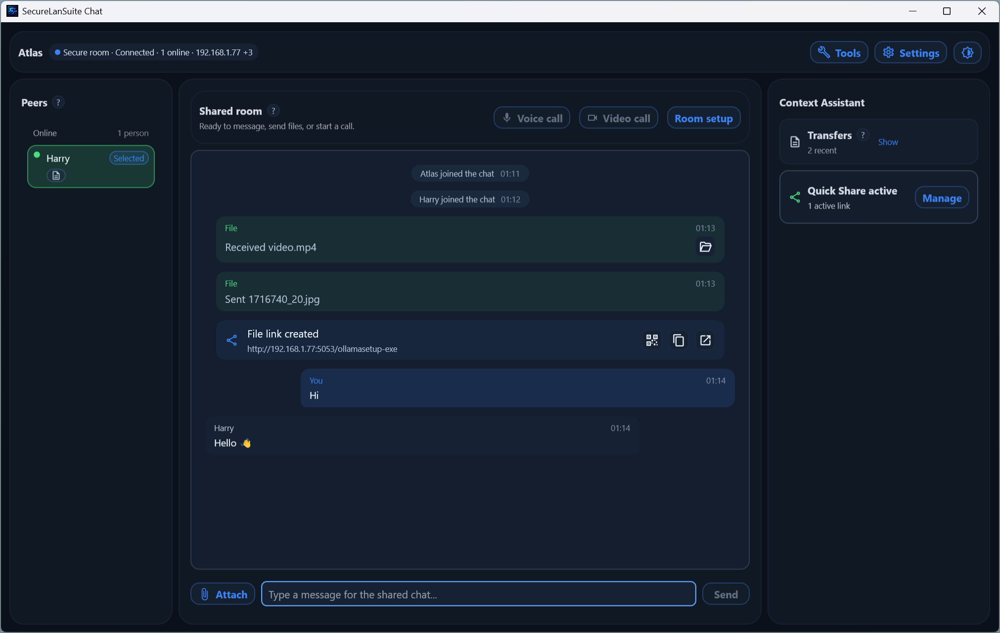
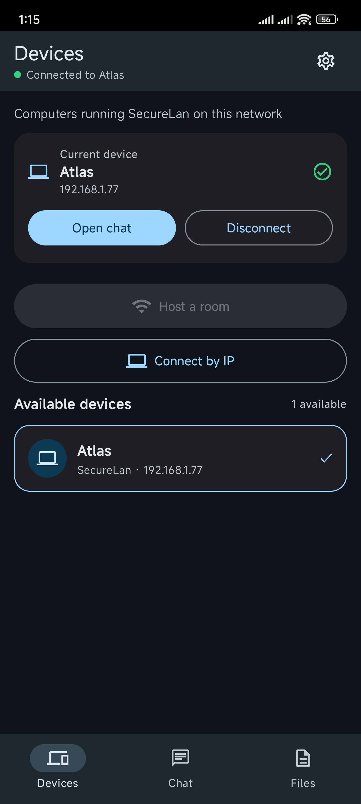
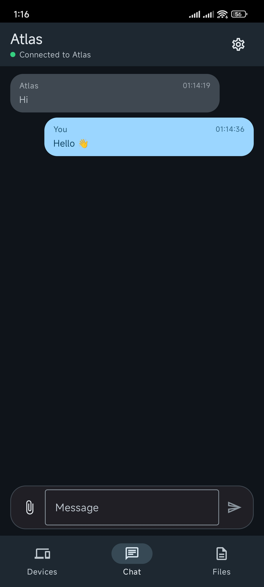
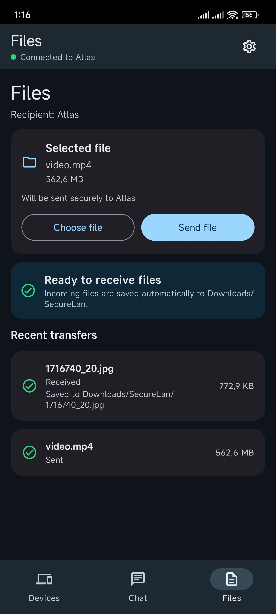

# Secure LAN Suite

Secure LAN Suite is a local-network secure communication suite with a Compose desktop client, an experimental interoperable Android client, and a separately packaged deprecated JavaFX fallback. Desktop and Android devices can discover each other, host or join password-protected rooms, chat, and transfer encrypted files without relying on a cloud service. The repository is a Gradle multi-module monorepo that keeps UI, networking, cryptography, file transfer, realtime media, and steganography concerns separated.

## Tech stack
- Current project version: 0.5.0
- Java 25
- Kotlin 2.2.21 for the Android client and migrated JVM core modules
- Gradle Wrapper 9.4.1
- Compose Multiplatform 1.9.0 for the desktop Compose shell
- JavaFX 25.0.2 for the separately packaged deprecated desktop fallback
- Android Gradle Plugin 9.1.1, Kotlin 2.2.21, and Jetpack Compose Material 3 for the experimental Android client
- `webrtc-java` 0.14.0 for realtime data, voice, and experimental video transport
- `jpackage` for native application images and installers
- WiX 5.0.2 for Windows EXE installers

## Project structure

### Applications
- `apps/desktop-client` — primary Compose desktop client and its packaging tasks
- `apps/javafx-client` — deprecated JavaFX desktop fallback and its packaging tasks
- `apps/android-client` — experimental native Android client for hosting or joining LAN rooms, secure chat, and encrypted file transfer interoperability with the desktop client

### Modules
- `modules/common-model` — shared DTO records, enums, app events, transfer models, RTC signaling models
- `modules/common-net` — shared network constants, TCP endpoint/socket helpers, reusable text/frame channels, server accept-loop utilities, and UDP broadcast address resolution
- `modules/crypto-core` — AES-GCM, RSA, hashing, signatures, key generation, file crypto workflows, keystore helpers
- `modules/chat-core` — secure chat server/client, handshake, message protocol, signaling transport, UDP peer discovery
- `modules/file-transfer-core` — encrypted file transfer client/server, secure handshake, progress events
- `modules/webrtc-core` — RTC session orchestration, WebRTC runtime/provider integration, data channels, voice, experimental video, diagnostics
- `modules/audio-core` — default audio profile hints used by desktop/realtime flows
- `modules/webcam-core` — default video profile hints used by desktop/realtime flows
- `modules/stego-core` — UI-free BMP steganography services for binary/text payload hide/extract workflows, password-based encrypt-then-hide flows, and image inspection

## Current product state

### Working now
- start and stop a local secure chat room
- automatically join the locally hosted room from the same desktop client
- connect manually to a remote room by host and port
- discover Secure LAN Suite peers on the LAN with UDP broadcast/listen mode
- control room visibility with the **Discoverable** checkbox
- connect to a discovered peer directly from the peer list
- complete an encrypted chat handshake using the shared room password
- send and receive chat messages in the shared room activity feed
- start a secure file-transfer listener together with the chat room or client connection
- send files from the desktop UI to a selected online peer
- receive files into a configurable downloads directory
- show transfer progress and transfer status in the main workspace
- publish temporary no-auth LAN browser links for files or text snippets with expiration and access limits
- copy, open, or display Quick Share links as QR codes from the desktop client
- route RTC signaling through `chat-core` into `webrtc-core`
- start voice sessions backed by native `webrtc-java`
- choose detected microphone and camera capture devices for RTC sessions
- test microphone capture and open a camera preview window from the desktop UI
- start experimental 1-to-1 video calls with an inline video stage
- use the desktop steganography tools to hide/extract text payloads in uncompressed BMP images, encrypt payloads with a password, and inspect image bit planes and channel statistics
- persist desktop profile, appearance, network, media, download, window, and diagnostics settings next to the portable application
- build and install the experimental Android client as debug or release APK
- discover peers from Android, host a desktop-compatible room or connect to one, exchange encrypted chat messages, send selected files, and receive encrypted files into `Downloads/SecureLan`
- use the adaptive Android phone/tablet layout, system/light/dark themes, and system/English/Russian UI language
- monitor server, connection, selected peer, voice, transfer, runtime, and diagnostics state from the compact UI
- use the messenger-style desktop layout with peers on the left, the shared room in the center, and contextual status/actions on the right

### Current UI layout
The primary desktop client uses a **messenger-style Compose workspace**. The JavaFX UI is isolated in `apps/javafx-client` and remains only for critical fixes and rollback.

- **Top bar** — local profile, room/connection summary, theme control, and entry points for Tools and Settings
- **Left column** — online, discovered, and selected peers
- **Center column** — shared-room header, call controls, optional inline video stage, chat/file/system events, attachments, and message composer
- **Right column** — context assistant with active transfers, Quick Share state, and other relevant actions
- **Tools** — Quick Share, steganography, RTC data, diagnostics, and experimental utilities kept outside the main conversation flow

### Realtime status
- `RTCDataChannel` is integrated and available from the desktop client
- voice sessions are the primary supported realtime media flow
- microphone and camera capture device selection is exposed in the desktop UI
- camera preview and 1-to-1 video calls are implemented but remain **experimental**
- local and remote video preview behavior can be controlled with JVM system properties:
  - `securelan.rtc.videoPreview.local.enabled`
  - `securelan.rtc.videoPreview.remote.enabled`

## Screenshots

### Desktop

### Android

  
  
  

## Development and packaging

Development, build, run, smoke-test, and packaging details are intentionally kept outside this overview:

- Development guide: [`docs/development.md`](docs/development.md)
- Android client build/signing/install guide: [`apps/android-client/android-readme.md`](apps/android-client/android-readme.md)
- Windows WiX installation guide: [`docs/wix-installation.md`](docs/wix-installation.md)
- Realtime/WebRTC architecture notes: [`docs/webrtc-architecture.md`](docs/webrtc-architecture.md)
- Migration and roadmap checklist: [`docs/migration-roadmap.md`](docs/migration-roadmap.md)

## Architecture notes

### Chat and discovery
- `chat-core` provides the secure room server/client, shared message protocol, and secure handshake integration
- `chat-core` also provides UDP broadcast/listen peer discovery through `PeerDiscoveryService`
- `desktop-client` starts discovery in listen-only mode by default and broadcasts when a hosted room is discoverable
- discovered peers are shown in the left peer list and can populate manual connection fields automatically

### File transfer
- chat uses the configured chat port, for example `5050`
- encrypted app-to-app file transfer uses a separate configured port, commonly `5051`
- encrypted app-to-app file transfer uses `crypto-core` with an ephemeral RSA key exchange and AES-GCM encrypted payload chunks
- transfer progress is exposed through shared progress models and desktop UI transfer entries
- no-auth LAN browser quick share uses a separate temporary HTTP server, commonly `5053`, in `file-transfer-core`
- browser quick-share payloads are not encrypted by the app because the receiver is a plain browser over local HTTP; use it only on trusted LANs
- the experimental Android client uses the shared networking/chat/file-transfer modules where possible and keeps its Android-specific protocol and service integration inside `apps/android-client`
- Android room hosting runs as a foreground service, advertises the room through LAN discovery, and accepts desktop-compatible secure chat connections

### Realtime architecture
- `chat-core` transports realtime signaling envelopes between peers over the secure chat path
- `webrtc-core` owns RTC session state, signaling integration, diagnostics, and runtime/provider integration
- `webrtc-core` boots a native `webrtc-java` engine and reuses chat signaling for SDP and ICE exchange
- `RTCDataChannel` support remains in `webrtc-core`, but the desktop UI currently prioritizes voice/video controls and runtime diagnostics over data-channel test controls
- `audio-core` and `webcam-core` expose default media profile hints for desktop/realtime sessions
- implementation notes: [`docs/webrtc-architecture.md`](docs/webrtc-architecture.md)

### Steganography
- `stego-core` provides UI-agnostic BMP steganography services for uncompressed 24-bit and 32-bit BMP images
- payloads are embedded into color-channel least-significant bits with a compact SecureLanSuite header containing magic, version, flags, content type, and payload length
- service APIs support binary payloads, UTF-8 text convenience methods, and password-based encrypt-then-hide workflows through `crypto-core`
- the desktop client exposes a standalone Steganography tool for selecting PNG/BMP/JPG/JPEG images, inspecting capacity, hiding or extracting text, using optional password encryption, and inspecting image bit planes/channel statistics; non-BMP cover images are converted to BMP output before embedding
- no JavaFX code is present in `stego-core`; Compose integration stays in `apps/desktop-client`, while the deprecated JavaFX integration stays in `apps/javafx-client`

## Current limitations
- `common-net` still contains only the shared network baseline; richer reusable transport abstractions are not finished
- LAN discovery is implemented with UDP broadcast and may still require hardening for complex networks, firewalls, VPNs, and multi-adapter setups
- key management and advanced transfer controls are not fully exposed in the desktop UI yet
- video calls and preview are experimental and may fail on some Windows/JDK/camera combinations
- microphone, speaker output, and camera device selection/testing are exposed, but cross-device media validation remains open
- desktop steganography currently targets text workflows over uncompressed 24-bit/32-bit BMP images; arbitrary binary payload embedding is available in the core API but not exposed in the UI
- Android remains an experimental interoperability client; it supports desktop-compatible room hosting and joining, but does not yet implement voice, WebRTC data channels, camera/video, steganography tools, screen sharing, or no-auth browser quick share
- chunked large file transfer over `RTCDataChannel` is not implemented yet
- screen sharing is not implemented yet
- EXE packaging is Windows-only because `jpackage` does not cross-build Windows installers
