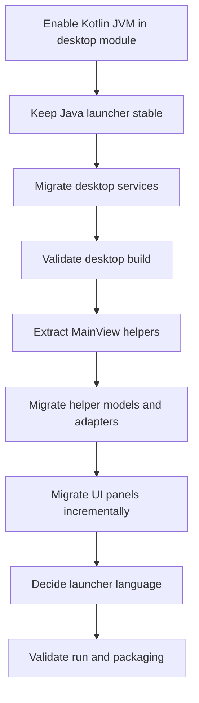

# Desktop Client Kotlin Migration Plan

## Goal

Start Phase 8 by migrating `apps/desktop-client` to Kotlin incrementally while keeping the JavaFX UI, LAN interoperability, and packaging behavior stable.

## Scope for the first migration slice

- Enable Kotlin JVM support in the desktop application module.
- Keep the Java launcher and JavaFX application entry point unchanged.
- Migrate only non-UI desktop services first.
- Leave the large `MainView.java` UI shell in Java until smaller helpers and panels are extracted.
- Validate that the desktop module still builds after the first slice.

## Planned sequence

## Checklist

- [x] Apply Kotlin JVM plugin to `apps/desktop-client/build.gradle` without changing JavaFX, Application, dependencies, `application.mainClass`, JAR manifest, or jpackage tasks.
- [x] Confirm desktop Kotlin source layout under `apps/desktop-client/src/main/kotlin`.
- [x] Keep `Main.java` and `ChatApplication.java` in Java for the first slice.
- [x] Replace the duplicate desktop nickname service with reuse of the shared chat-core `RandomNicknameService` API.
- [x] Keep canonical nickname generation in shared chat-core `DefaultRandomNicknameService`, preserving the no-arg constructor, injectable `RandomGenerator` constructor, nickname list, and null validation.
- [x] Delete duplicated desktop-client nickname service files.
- [x] Switch `MainView.java` back to the shared chat-core nickname service imports.
- [x] Run `gradlew.bat :modules:chat-core:test :apps:desktop-client:build` after deduplicating the nickname service.
- [x] If build succeeds, record Phase 8 first-slice status in `docs/kotlin-migration.md` and `docs/kotlin-api-baseline.md` if public desktop API notes are needed.
- [x] Extract pure transfer formatting helpers from `MainView.java` into Kotlin and cover them with desktop-client tests.
- [x] Extract pure quick-share display formatting from `MainView.java` into Kotlin and cover it with desktop-client tests.
- [x] Extract desktop media-device choice wrapper from `MainView.java` into Kotlin and cover it with desktop-client tests.
- [x] Extract peer presence model from `MainView.java` into Kotlin and cover it with desktop-client tests.
- [x] Extract quick-share entry wrapper from `MainView.java` into Kotlin and cover it with desktop-client tests.
- [x] Extract transfer list entry state and speed tracking from `MainView.java` into Kotlin and cover it with desktop-client tests.
- [x] Extract peer display metadata formatting from `MainView.java` into Kotlin and cover it with desktop-client tests.
- [x] Extract transfer hint and active-transfer summary text from `MainView.java` into Kotlin and cover it with desktop-client tests.
- [x] Extract realtime profile, runtime status, and audio-level display formatting from `MainView.java` into Kotlin and cover it with desktop-client tests.
- [x] Extract quick-share text display-name and landing/status formatting from [`MainView.java`](../apps/desktop-client/src/main/java/com/shterneregen/securelan/desktop/ui/MainView.java) into Kotlin and cover it with desktop-client tests.
- [x] Extract desktop JavaFX list-cell renderers from [`MainView.java`](../apps/desktop-client/src/main/java/com/shterneregen/securelan/desktop/ui/MainView.java) into Kotlin and move transfer-row metadata formatting behind a tested Kotlin helper.
- [x] Extract the remaining low-risk pre-conversion helpers for stego output naming, local file-port selection, remote-address host parsing, peer matching, and file-transfer error messages from [`MainView.java`](../apps/desktop-client/src/main/java/com/shterneregen/securelan/desktop/ui/MainView.java) into Kotlin and cover them with desktop-client tests. Validation: `gradlew.bat :apps:desktop-client:test` passed in this slice.
- [x] Convert [`MainView.java`](../apps/desktop-client/src/main/java/com/shterneregen/securelan/desktop/ui/MainView.java) to [`MainView.kt`](../apps/desktop-client/src/main/kotlin/com/shterneregen/securelan/desktop/ui/MainView.kt) through a controlled source conversion after the currently extracted helpers are stable. Implemented as a Kotlin JVM `MainView` compatibility shell delegating to package-private Java `MainViewDelegate`, preserving the public class identity and lifecycle API while retiring the duplicate Java `MainView` source. Validation: `gradlew.bat :apps:desktop-client:test :apps:desktop-client:build` passed after the conversion.

## MainView Kotlin conversion plan

### Key conclusion

The remaining [`MainView.java`](../apps/desktop-client/src/main/java/com/shterneregen/securelan/desktop/ui/MainView.java) migration should be a controlled source conversion, not a redesign. The target file is [`MainView.kt`](../apps/desktop-client/src/main/kotlin/com/shterneregen/securelan/desktop/ui/MainView.kt), but it must still expose the JVM class `com.shterneregen.securelan.desktop.ui.MainView` so the existing Java application boundary keeps working.

The Java entry point boundary stays unchanged during this conversion:

- [`Main.java`](../apps/desktop-client/src/main/java/com/shterneregen/securelan/desktop/Main.java) remains the launcher resolved by the Application plugin, manifest, and packaging tasks.
- [`ChatApplication.java`](../apps/desktop-client/src/main/java/com/shterneregen/securelan/desktop/ChatApplication.java) remains Java and continues constructing `com.shterneregen.securelan.desktop.ui.MainView`.
- [`MainView.kt`](../apps/desktop-client/src/main/kotlin/com/shterneregen/securelan/desktop/ui/MainView.kt) must preserve the public no-argument constructor plus the Java-callable `createContent()` and `shutdown()` methods used by the JavaFX application lifecycle.
- No product behavior, protocol behavior, service orchestration, packaging main-class setting, CSS/resource loading, or JavaFX UX layout should be redesigned as part of the language conversion.

### Already available Kotlin helpers

The current baseline in [`docs/kotlin-migration.md`](kotlin-migration.md) and [`docs/kotlin-api-baseline.md`](kotlin-api-baseline.md) shows that the desktop module already has Kotlin support and several low-risk pieces extracted from [`MainView.java`](../apps/desktop-client/src/main/java/com/shterneregen/securelan/desktop/ui/MainView.java):

- [`MediaDeviceChoice.kt`](../apps/desktop-client/src/main/kotlin/com/shterneregen/securelan/desktop/ui/MediaDeviceChoice.kt): Java-callable media-device wrapper for system-default and concrete device selections.
- [`PeerPresence.kt`](../apps/desktop-client/src/main/kotlin/com/shterneregen/securelan/desktop/ui/PeerPresence.kt): desktop peer-presence model with discovery updates and offline transitions.
- [`QuickShareEntry.kt`](../apps/desktop-client/src/main/kotlin/com/shterneregen/securelan/desktop/ui/QuickShareEntry.kt): quick-share list entry wrapper around snapshots.
- [`TransferEntry.kt`](../apps/desktop-client/src/main/kotlin/com/shterneregen/securelan/desktop/ui/TransferEntry.kt): transfer row state, progress, direction labels, active-state detection, and speed tracking.
- [`DesktopTransferFormatters.kt`](../apps/desktop-client/src/main/kotlin/com/shterneregen/securelan/desktop/ui/DesktopTransferFormatters.kt): transfer display text, hints, active-transfer summary, and transfer-row metadata.
- [`DesktopQuickShareFormatters.kt`](../apps/desktop-client/src/main/kotlin/com/shterneregen/securelan/desktop/ui/DesktopQuickShareFormatters.kt): quick-share display names, text-share names, server status, and landing URL text.
- [`DesktopRealtimeFormatters.kt`](../apps/desktop-client/src/main/kotlin/com/shterneregen/securelan/desktop/ui/DesktopRealtimeFormatters.kt): realtime profile, runtime availability/status, microphone labels, remote peer labels, and audio-level text.
- [`DesktopPeerFormatters.kt`](../apps/desktop-client/src/main/kotlin/com/shterneregen/securelan/desktop/ui/DesktopPeerFormatters.kt): peer list metadata and selected-peer status copy.
- [`DesktopListCells.kt`](../apps/desktop-client/src/main/kotlin/com/shterneregen/securelan/desktop/ui/DesktopListCells.kt): JavaFX list-cell renderers for media devices, peers, quick shares, and transfers.

These helpers should be reused from the Kotlin shell rather than inlined back into [`MainView.kt`](../apps/desktop-client/src/main/kotlin/com/shterneregen/securelan/desktop/ui/MainView.kt).

### Phased conversion plan

1. **Freeze the current baseline.**
   - Treat the existing [`MainView.java`](../apps/desktop-client/src/main/java/com/shterneregen/securelan/desktop/ui/MainView.java) behavior as the source of truth.
   - Confirm a green baseline with `gradlew.bat :apps:desktop-client:test :apps:desktop-client:build` before the source conversion.
   - Keep [`Main.java`](../apps/desktop-client/src/main/java/com/shterneregen/securelan/desktop/Main.java), [`ChatApplication.java`](../apps/desktop-client/src/main/java/com/shterneregen/securelan/desktop/ChatApplication.java), build files, packaging configuration, resources, CSS, and module dependencies unchanged.

2. **Extract any remaining low-risk helpers before the shell move.**
   - Prefer tiny, behavior-preserving helpers with deterministic tests when extraction is safer than converting the logic inside the large UI class.
   - Candidate helpers still suitable for extraction are `hostFromRemoteAddress()`, `localFilePort()`, `samePeer()`, `suggestedStegoOutputPath()`, and `fileTransferErrorMessage()`.
   - Keep helper extraction in [`apps/desktop-client`](../apps/desktop-client) only; do not move JavaFX or desktop-specific state into reusable core modules.

3. **Mechanically convert the class shell.**
   - Create [`MainView.kt`](../apps/desktop-client/src/main/kotlin/com/shterneregen/securelan/desktop/ui/MainView.kt) in package `com.shterneregen.securelan.desktop.ui`.
   - Remove [`MainView.java`](../apps/desktop-client/src/main/java/com/shterneregen/securelan/desktop/ui/MainView.java) only in the same slice that proves there is no duplicate JVM class.
   - Preserve class name, constructor shape, method names, field initialization order, service creation order, event-handler wiring, lifecycle ownership, and shutdown semantics.
   - Keep constants and companion/object choices JavaFX-friendly and avoid changing visibility unless it is required for compilation.

4. **Review JavaFX interop explicitly.**
   - Check nullable state, selected items, observable lists, property listeners, bindings, image fields, stage references, and overloaded JavaFX methods after Kotlin conversion.
   - Ensure event handlers still run on the JavaFX application thread where the Java code did.
   - Preserve existing CSS style classes, resource lookup behavior, icon/image loading, window sizing, tab/pane structure, and UI control ordering.

5. **Convert UI builders without UX redesign.**
   - Convert card/pane/status-bar/list builder methods as source-equivalent Kotlin code.
   - Reuse [`DesktopListCells.kt`](../apps/desktop-client/src/main/kotlin/com/shterneregen/securelan/desktop/ui/DesktopListCells.kt) for list-cell factories.
   - Reuse formatter helpers instead of changing labels, statuses, hints, or summary text.
   - Avoid introducing a new UI architecture, FXML, TornadoFX, Compose, coroutines, or dependency-injection framework during this step.

6. **Convert service orchestration blocks conservatively.**
   - Preserve chat hosting/client connection flows, UDP discovery use, quick-share lifecycle, encrypted file-transfer send/receive flows, steganography calls, and RTC signaling transport through chat-core.
   - Keep crypto usage and file/network orchestration behind the same service boundaries already used by the Java class.
   - Do not change discovery, chat, file-transfer, quick-share, RTC signaling, voice, or video wire behavior.

7. **Review high-risk realtime and video code late.**
   - Convert voice, camera preview, video-frame handling, RTC callbacks, media-device refresh, diagnostics, and runtime status updates only after the rest of the shell compiles.
   - Treat video and camera preview as experimental and preserve fallback behavior plus diagnostics.
   - Pay special attention to Kotlin SAM/lambda interop with callback-heavy realtime APIs and nullable runtime state.

8. **Validate the converted desktop client.**
   - Run targeted tests and build first.
   - Launch through the Java launcher before attempting packaging.
   - Perform manual smoke checks against the same visible behavior that existed before the conversion.
   - Attempt packaging only after runtime launch and smoke checks are successful.

9. **Final cleanup.**
   - Remove temporary compatibility comments, unused imports, and dead code introduced by conversion.
   - Keep cleanup source-equivalent; do not fold in unrelated refactors.
   - Update documentation only after the converted [`MainView.kt`](../apps/desktop-client/src/main/kotlin/com/shterneregen/securelan/desktop/ui/MainView.kt) is validated and the desktop workflow status changes.

### Validation checklist

- `gradlew.bat :apps:desktop-client:test` passes.
- `gradlew.bat :apps:desktop-client:build` passes.
- The Java launcher path still starts the UI through [`Main.java`](../apps/desktop-client/src/main/java/com/shterneregen/securelan/desktop/Main.java) and [`ChatApplication.java`](../apps/desktop-client/src/main/java/com/shterneregen/securelan/desktop/ChatApplication.java).
- The public no-argument `MainView` constructor and Java-callable `createContent()` and `shutdown()` methods remain available to Java callers.
- Manual smoke validation covers room hosting, manual connect, UDP discovery, chat send/receive, encrypted file transfer send/receive, quick-share start/copy/stop, steganography encode/decode controls, media device selection, voice start/stop, audio levels, camera preview, 1-to-1 experimental video, theme/resource loading, and shutdown cleanup.
- Packaging validation is deferred until runtime success; then `gradlew.bat :apps:desktop-client:buildPortable` should be checked before `gradlew.bat :apps:desktop-client:buildExe` on a WiX-enabled Windows environment.

### Risks

- Kotlin null-safety can expose or alter assumptions around JavaFX selected values, optional runtime state, image/stage references, and service handles.
- JavaFX overloaded APIs, listener signatures, and SAM conversions can compile while changing subtle event-handler behavior.
- Duplicate [`MainView.java`](../apps/desktop-client/src/main/java/com/shterneregen/securelan/desktop/ui/MainView.java) and [`MainView.kt`](../apps/desktop-client/src/main/kotlin/com/shterneregen/securelan/desktop/ui/MainView.kt) classes would create a JVM class conflict if both are present with the same package/class name.
- Realtime voice/video and camera preview are high risk because callback ordering, diagnostics, and nullable runtime status are sensitive.
- Packaging may reveal classpath or Kotlin runtime issues even after local build/run succeeds.
- Large mechanical conversion may make review difficult, so unrelated refactors should remain out of scope.

### Rollback plan

- Restore [`MainView.java`](../apps/desktop-client/src/main/java/com/shterneregen/securelan/desktop/ui/MainView.java) from version control.
- Remove [`MainView.kt`](../apps/desktop-client/src/main/kotlin/com/shterneregen/securelan/desktop/ui/MainView.kt) to eliminate the duplicate JVM class.
- Keep only independently validated helper extractions that already have green tests and are still used by the Java UI shell.
- Re-run `gradlew.bat :apps:desktop-client:test :apps:desktop-client:build` after rollback.
- Do not roll back build files, launcher classes, protocols, or reusable modules as part of a failed [`MainView.kt`](../apps/desktop-client/src/main/kotlin/com/shterneregen/securelan/desktop/ui/MainView.kt) shell attempt unless the failed slice actually changed them.

### Completion criteria

- [`MainView.java`](../apps/desktop-client/src/main/java/com/shterneregen/securelan/desktop/ui/MainView.java) is removed and [`MainView.kt`](../apps/desktop-client/src/main/kotlin/com/shterneregen/securelan/desktop/ui/MainView.kt) provides JVM class `com.shterneregen.securelan.desktop.ui.MainView`. The existing JavaFX implementation is retained source-equivalently in package-private [`MainViewDelegate.java`](../apps/desktop-client/src/main/java/com/shterneregen/securelan/desktop/ui/MainViewDelegate.java) for this controlled interop slice.
- [`Main.java`](../apps/desktop-client/src/main/java/com/shterneregen/securelan/desktop/Main.java), [`ChatApplication.java`](../apps/desktop-client/src/main/java/com/shterneregen/securelan/desktop/ChatApplication.java), `application.mainClass`, manifest behavior, and packaging task wiring remain unchanged.
- The public constructor, `createContent()`, and `shutdown()` lifecycle contract are preserved for Java callers.
- Existing Kotlin helpers remain reused instead of duplicated in the converted shell.
- Tests and build validation pass. Java launcher runtime, manual smoke validation, and packaging validation remain follow-up checks after this interop slice.
- No JavaFX code moves outside [`apps/desktop-client`](../apps/desktop-client), no Spring dependency is introduced, no cyclic dependency is added, and discovery/chat/file-transfer/quick-share/RTC/voice/video protocols are unchanged.

## Guardrails

- Do not move JavaFX code into reusable core modules.
- Do not change protocol behavior for discovery, chat, file transfer, quick share, RTC signaling, voice, or experimental video.
- Do not change packaging output paths or main-class configuration during the first slice or the [`MainView.kt`](../apps/desktop-client/src/main/kotlin/com/shterneregen/securelan/desktop/ui/MainView.kt) conversion.
- Do not convert [`MainView.java`](../apps/desktop-client/src/main/java/com/shterneregen/securelan/desktop/ui/MainView.java) as an unreviewed automatic rewrite; keep the conversion source-equivalent and review JavaFX/realtime interop explicitly.
