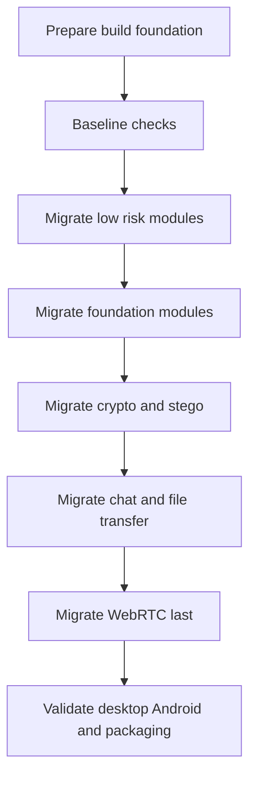

# Kotlin Migration Plan

## Scope

This plan covers migrating all reusable core modules from Java to Kotlin:

- [`modules/common-model`](../modules/common-model/build.gradle)
- [`modules/common-net`](../modules/common-net/build.gradle)
- [`modules/crypto-core`](../modules/crypto-core/build.gradle)
- [`modules/chat-core`](../modules/chat-core/build.gradle)
- [`modules/file-transfer-core`](../modules/file-transfer-core/build.gradle)
- [`modules/webrtc-core`](../modules/webrtc-core/build.gradle)
- [`modules/audio-core`](../modules/audio-core/build.gradle)
- [`modules/webcam-core`](../modules/webcam-core/build.gradle)
- [`modules/stego-core`](../modules/stego-core/build.gradle)

The desktop client in [`apps/desktop-client`](../apps/desktop-client/build.gradle) is assessed separately because it is an application module with JavaFX UI and packaging tasks.

## Current repository context

- The root build applies Java Library configuration to all non-Android subprojects in [`build.gradle`](../build.gradle:15).
- The current JVM baseline is Java 25 through [`languageVersion`](../build.gradle:21) and [`options.release`](../build.gradle:26).
- The Android client already uses Kotlin through [`org.jetbrains.kotlin.android`](../apps/android-client/build.gradle:3), with a JVM target configured in [`kotlinOptions`](../apps/android-client/build.gradle:53).
- The desktop client uses the Application plugin and JavaFX plugin in [`apps/desktop-client/build.gradle`](../apps/desktop-client/build.gradle:3).
- Desktop packaging uses [`jpackage`](../apps/desktop-client/build.gradle:80), [`buildPortable`](../apps/desktop-client/build.gradle:100), and [`buildExe`](../apps/desktop-client/build.gradle:158).
- The WebRTC module depends on [`webrtc-java`](../modules/webrtc-core/build.gradle:3), so it should be treated as a high-risk migration area.

## Target approach

Use a gradual mixed Java and Kotlin migration. Do not convert the whole repository at once. Keep each module buildable after every migration step and preserve existing public APIs unless an API change is reviewed explicitly.

## Migration phases

### Phase 0: Build foundation

- Add the Kotlin JVM plugin to the root build in a way that does not affect [`apps/android-client`](../apps/android-client/build.gradle).
- Keep Java Library configuration for JVM modules from [`build.gradle`](../build.gradle:15).
- Configure Kotlin JVM toolchains consistently with the Java 25 baseline from [`build.gradle`](../build.gradle:21).
- Verify that Kotlin compiler target settings are compatible with Java compile settings from [`build.gradle`](../build.gradle:25).
- Prefer centralized version management for Kotlin plugins so the Android and JVM sides do not drift unnecessarily.
- Keep the module graph in [`settings.gradle`](../settings.gradle:11) unchanged.

### Phase 1: Baseline validation

- Run a clean full build before migration.
- Record public API contracts for models, services, events, protocol classes, and exceptions.
- Run the desktop client through [`apps/desktop-client`](../apps/desktop-client/build.gradle).
- Build the Android debug APK through [`apps/android-client`](../apps/android-client/build.gradle).
- Keep the current protocol behavior unchanged for LAN discovery, chat handshake, file transfer, and RTC signaling.

Status: completed. The clean full build passed, Android debug assembly was covered by the full build, and the reusable module public API baseline is captured in [`docs/kotlin-api-baseline.md`](kotlin-api-baseline.md).

### Phase 2: Low-risk modules first

- Migrate [`modules/audio-core`](../modules/audio-core/build.gradle) first.
- Migrate [`modules/webcam-core`](../modules/webcam-core/build.gradle) second.
- Recheck module dependency rules before changing these modules, because current build files depend on [`modules/webrtc-core`](../modules/webrtc-core/build.gradle).
- Keep these modules small and profile-oriented; do not introduce UI code or Android-specific dependencies.

Status: completed. [`modules/audio-core`](../modules/audio-core/build.gradle) and [`modules/webcam-core`](../modules/webcam-core/build.gradle) now use Kotlin JVM and keep Java-callable record-style profile DTOs through Kotlin JVM records.

Compatibility note: Kotlin 2.2.21 does not yet emit JVM target 25 bytecode, so Kotlin JVM modules compile with JVM target 24 while the Java toolchain remains Java 25. The build explicitly ignores Kotlin/Java target validation for migrated JVM modules until Kotlin supports JVM target 25.

### Phase 3: Foundation modules

- Migrate [`modules/common-net`](../modules/common-net/build.gradle) before higher-level networking modules.
- Preserve socket lifecycle behavior, transport exceptions, text channels, frame channels, TCP server utilities, and UDP broadcast address resolution.
- Migrate [`modules/common-model`](../modules/common-model/build.gradle) carefully because it defines shared DTOs and events used across clients and core modules.
- Decide per model whether to keep Java records temporarily or replace them with Kotlin data classes after checking Java caller compatibility.
- Preserve RTC signaling payload behavior from the common model package.

Status: completed. [`modules/common-net`](../modules/common-net/build.gradle) and [`modules/common-model`](../modules/common-model/build.gradle) now use Kotlin JVM. Common model DTOs use Kotlin JVM records where the constructor contract is record-compatible; [`RtcSignalEnvelope`](../modules/common-model/src/main/kotlin/com/shterneregen/securelan/common/model/rtc/RtcSignalEnvelope.kt) remains a Java-callable Kotlin class to preserve null-normalization and factory behavior.

### Phase 4: Crypto and steganography

- Migrate [`modules/crypto-core`](../modules/crypto-core/build.gradle) only with strict test coverage for AES-GCM, RSA, hashing, signatures, key generation, key encoding, and file crypto workflows.
- Preserve byte-level behavior, exception semantics, and resource handling.
- Do not introduce coroutine-based crypto APIs unless a separate API design is approved.
- Migrate [`modules/stego-core`](../modules/stego-core/build.gradle) after crypto-core validation.
- Preserve BMP capacity checks, header layout, payload encoding, password-based encryption integration, and oversized payload behavior.

Status: completed. [`modules/crypto-core`](../modules/crypto-core/build.gradle) and [`modules/stego-core`](../modules/stego-core/build.gradle) now use Kotlin JVM. Crypto services preserve AES-GCM/RSA/signature/hash/key/file workflow behavior, while encrypted payload model classes remain defensive-copy Kotlin classes rather than JVM records. Steganography preserves BMP capacity/header/payload behavior and password encrypt-then-hide integration.

### Phase 5: Chat and file transfer

- Migrate [`modules/chat-core`](../modules/chat-core/build.gradle) after common-net and crypto-core are stable.
- Preserve UDP discovery wire format, handshake behavior, chat events, receive loops, service interfaces, and signaling transport.
- Migrate [`modules/file-transfer-core`](../modules/file-transfer-core/build.gradle) after transport and crypto APIs are stable.
- Preserve file metadata format, encrypted transfer handshake, progress events, acceptance handling, and integration tests.
- Avoid changing desktop and Android interoperability protocols during this phase.

### Phase 6: WebRTC last

- Migrate [`modules/webrtc-core`](../modules/webrtc-core/build.gradle) last.
- Start with small event classes, service interfaces, and configuration objects.
- Keep runtime-heavy code on Java until Kotlin interop with [`webrtc-java`](../modules/webrtc-core/build.gradle:3) callbacks is proven safe.
- Preserve diagnostics for provider initialization, SDP, ICE, media devices, audio levels, video frames, preview conversion, and runtime failures.
- Treat video-related code as experimental and avoid expanding scope during migration.

### Phase 7: Tests and documentation

- Migrate tests close to the corresponding production module, but do not rewrite tests and production behavior in the same large commit.
- Update [`README.md`](../README.md) if Kotlin becomes part of the official core stack.
- Update [`docs/development.md`](development.md) if build, run, or environment requirements change.
- Update packaging documentation if Kotlin runtime dependencies affect desktop distributions.

## Pros of moving from Java to Kotlin

- Less boilerplate in models, events, request objects, and tests.
- Stronger null-safety at compile time for network responses, optional runtime state, selected peers, session state, and UI adapters.
- More concise immutable models through data classes where API compatibility allows them.
- Better alignment with the existing Android client, which is already Kotlin-based in [`apps/android-client`](../apps/android-client/build.gradle).
- Easier mapper and adapter code for shared protocol compatibility between desktop and Android.
- Gradual migration is possible because Java and Kotlin interoperate on the JVM.
- Test fixtures and small service implementations can become easier to read.

## Cons and risks of moving from Java to Kotlin

- Build configuration becomes more complex because JVM modules need Kotlin plugin and toolchain setup.
- Kotlin compiler target compatibility with Java 25 must be verified before adopting Kotlin across all core modules.
- Mixed Java and Kotlin builds can fail if Java and Kotlin target settings drift.
- Public API compatibility may change, especially if Java records are replaced by Kotlin data classes.
- Desktop packaging must include Kotlin runtime dependencies in the runtime classpath used by [`jpackage`](../apps/desktop-client/build.gradle:80).
- Compile time may increase.
- Kotlin interop with callback-heavy Java APIs can be less obvious in [`modules/webrtc-core`](../modules/webrtc-core/build.gradle).
- Crypto, protocol, and transfer modules are sensitive to subtle behavior changes from automatic conversion.
- The project gains a second JVM language in core modules, increasing review and maintenance requirements.

## Desktop client Kotlin assessment

The desktop client can be migrated to Kotlin, but it should not be the first migration target.

### Why it is technically possible

- JavaFX APIs can be used from Kotlin.
- The desktop module can remain a JVM application module.
- The existing Application plugin configuration in [`apps/desktop-client/build.gradle`](../apps/desktop-client/build.gradle:3) can continue to produce a runnable application.
- Packaging with [`jpackage`](../apps/desktop-client/build.gradle:80) can still work if the main class and runtime classpath are correct.

### Why it should be delayed

- The main UI class [`MainView.java`](../apps/desktop-client/src/main/java/com/shterneregen/securelan/desktop/ui/MainView.java) is very large and should be split before language migration.
- JavaFX listeners, properties, overloaded methods, and nullable UI state require careful Kotlin interop.
- The desktop client depends on almost every reusable module through [`apps/desktop-client/build.gradle`](../apps/desktop-client/build.gradle:21), so core API churn would affect it heavily.
- Packaging tasks depend on main JAR naming, runtime classpath, and main class configuration in [`apps/desktop-client/build.gradle`](../apps/desktop-client/build.gradle:42).

### Recommended desktop path

- Keep the current Java launcher initially.
- Extract smaller UI components and desktop services from [`MainView.java`](../apps/desktop-client/src/main/java/com/shterneregen/securelan/desktop/ui/MainView.java).
- Migrate non-UI desktop services before UI panels.
- Migrate UI panels one at a time.
- Change the application entry point only after packaging tasks are verified.

## Acceptance criteria

- Full build succeeds from the repository root.
- Desktop client launches successfully.
- Android debug APK builds successfully.
- Unit and integration tests pass for every migrated module.
- UDP discovery, secure chat handshake, encrypted file transfer, RTC signaling, and desktop Android interoperability stay compatible.
- Public module dependency directions remain acyclic and aligned with architecture rules.
- Portable ZIP packaging through [`buildPortable`](../apps/desktop-client/build.gradle:100) still includes all required runtime dependencies.
- Windows EXE packaging through [`buildExe`](../apps/desktop-client/build.gradle:158) still works on a WiX-enabled Windows environment.
- Documentation is updated where the official language stack, build process, or product status changes.

## Implementation checklist

- [x] Add Kotlin JVM plugin setup for JVM modules without changing Android plugin behavior.
- [x] Verify Kotlin plugin resolution with Gradle 9.1 or newer and the existing Android Kotlin version.
- [x] Configure Kotlin JVM toolchain consistently with the Java 25 toolchain.
- [x] Run Phase 1 clean full build baseline validation.
- [x] Capture reusable module public API baseline in [`docs/kotlin-api-baseline.md`](kotlin-api-baseline.md).
- [x] Enable Kotlin in one low-risk JVM module first.
- [x] Migrate [`modules/audio-core`](../modules/audio-core/build.gradle) and validate the full build.
- [x] Migrate [`modules/webcam-core`](../modules/webcam-core/build.gradle) and validate the full build.
- [x] Migrate [`modules/common-net`](../modules/common-net/build.gradle) and validate transport tests.
- [x] Review the public API strategy for [`modules/common-model`](../modules/common-model/build.gradle).
- [x] Migrate [`modules/common-model`](../modules/common-model/build.gradle) without breaking Java callers.
- [x] Migrate [`modules/crypto-core`](../modules/crypto-core/build.gradle) with byte-level behavior tests.
- [x] Migrate [`modules/stego-core`](../modules/stego-core/build.gradle) after crypto validation.
- [ ] Migrate [`modules/chat-core`](../modules/chat-core/build.gradle) and run chat integration tests.
- [ ] Migrate [`modules/file-transfer-core`](../modules/file-transfer-core/build.gradle) and run file transfer integration tests.
- [ ] Migrate low-risk parts of [`modules/webrtc-core`](../modules/webrtc-core/build.gradle).
- [ ] Decide whether high-risk WebRTC runtime implementation should remain Java.
- [ ] Run desktop launch validation.
- [ ] Run Android APK build validation.
- [ ] Run portable ZIP packaging validation.
- [ ] Run Windows EXE packaging validation where WiX is available.
- [ ] Update [`README.md`](../README.md) and [`docs/development.md`](development.md) if the official stack or build flow changes.

## Recommended next decision

Start with build foundation and a proof-of-migration on [`modules/audio-core`](../modules/audio-core/build.gradle). This gives the project a safe Kotlin JVM setup before touching public models, protocols, cryptography, file transfer, or WebRTC runtime code.
