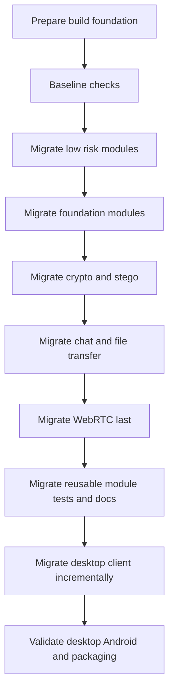
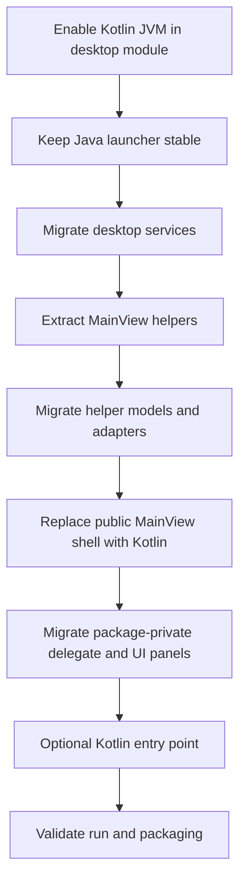

# Kotlin Migration Plan

## Scope

This plan covers migrating all reusable core modules from Java to Kotlin:

- [`modules/common-model`](../modules/common-model/build.gradle)
- [`modules/common-net`](../modules/common-net/build.gradle)
- [`modules/crypto-core`](../modules/crypto-core/build.gradle)
- [`modules/chat-core`](../modules/chat-core/build.gradle)
- [`modules/file-transfer-core`](../modules/file-transfer-core/build.gradle)
- [`modules/webrtc-core`](../modules/webrtc-core/build.gradle)
- [`modules/audio-core`](../modules/audio-core/build.gradle)
- [`modules/webcam-core`](../modules/webcam-core/build.gradle)
- [`modules/stego-core`](../modules/stego-core/build.gradle)

The desktop client in [`apps/desktop-client`](../apps/desktop-client/build.gradle) is assessed separately because it is an application module with JavaFX UI and packaging tasks.

## Current repository context

- The root build applies Java Library configuration to all non-Android subprojects in [`build.gradle`](../build.gradle:15).
- The current JVM baseline is Java 25 through [`languageVersion`](../build.gradle:21) and [`options.release`](../build.gradle:26).
- The Android client already uses Kotlin through [`org.jetbrains.kotlin.android`](../apps/android-client/build.gradle:3), with a JVM target configured in [`kotlinOptions`](../apps/android-client/build.gradle:53).
- The desktop client uses the Application plugin and JavaFX plugin in [`apps/desktop-client/build.gradle`](../apps/desktop-client/build.gradle:3).
- Desktop packaging uses [`jpackage`](../apps/desktop-client/build.gradle:80), [`buildPortable`](../apps/desktop-client/build.gradle:100), and [`buildExe`](../apps/desktop-client/build.gradle:158).
- The WebRTC module depends on [`webrtc-java`](../modules/webrtc-core/build.gradle:3), so it should be treated as a high-risk migration area.

## Target approach

Use a gradual mixed Java and Kotlin migration. Do not convert the whole repository at once. Keep each module buildable after every migration step and preserve existing public APIs unless an API change is reviewed explicitly.

```mermaid
flowchart TD
    A[Prepare build foundation] --> B[Baseline checks]
    B --> C[Migrate low risk modules]
    C --> D[Migrate foundation modules]
    D --> E[Migrate crypto and stego]
    E --> F[Migrate chat and file transfer]
    F --> G[Migrate WebRTC last]
    G --> H[Migrate reusable module tests and docs]
    H --> I[Migrate desktop client incrementally]
    I --> J[Validate desktop Android and packaging]
```

## Migration phases

### Phase 0: Build foundation

- Add the Kotlin JVM plugin to the root build in a way that does not affect [`apps/android-client`](../apps/android-client/build.gradle).
- Keep Java Library configuration for JVM modules from [`build.gradle`](../build.gradle:15).
- Configure Kotlin JVM toolchains consistently with the Java 25 baseline from [`build.gradle`](../build.gradle:21).
- Verify that Kotlin compiler target settings are compatible with Java compile settings from [`build.gradle`](../build.gradle:25).
- Prefer centralized version management for Kotlin plugins so the Android and JVM sides do not drift unnecessarily.
- Keep the module graph in [`settings.gradle`](../settings.gradle:11) unchanged.

### Phase 1: Baseline validation

- Run a clean full build before migration.
- Record public API contracts for models, services, events, protocol classes, and exceptions.
- Run the desktop client through [`apps/desktop-client`](../apps/desktop-client/build.gradle).
- Build the Android debug APK through [`apps/android-client`](../apps/android-client/build.gradle).
- Keep the current protocol behavior unchanged for LAN discovery, chat handshake, file transfer, and RTC signaling.

Status: completed. The clean full build passed, Android debug assembly was covered by the full build, and the reusable module public API baseline is captured in [`docs/kotlin-api-baseline.md`](kotlin-api-baseline.md).

### Phase 2: Low-risk modules first

- Migrate [`modules/audio-core`](../modules/audio-core/build.gradle) first.
- Migrate [`modules/webcam-core`](../modules/webcam-core/build.gradle) second.
- Recheck module dependency rules before changing these modules, because current build files depend on [`modules/webrtc-core`](../modules/webrtc-core/build.gradle).
- Keep these modules small and profile-oriented; do not introduce UI code or Android-specific dependencies.

Status: completed. [`modules/audio-core`](../modules/audio-core/build.gradle) and [`modules/webcam-core`](../modules/webcam-core/build.gradle) now use Kotlin JVM and keep Java-callable record-style profile DTOs through Kotlin JVM records.

Compatibility note: Kotlin 2.2.21 does not yet emit JVM target 25 bytecode, so Kotlin JVM modules compile with JVM target 24 while the Java toolchain remains Java 25. The build explicitly ignores Kotlin/Java target validation for migrated JVM modules until Kotlin supports JVM target 25.

### Phase 3: Foundation modules

- Migrate [`modules/common-net`](../modules/common-net/build.gradle) before higher-level networking modules.
- Preserve socket lifecycle behavior, transport exceptions, text channels, frame channels, TCP server utilities, and UDP broadcast address resolution.
- Migrate [`modules/common-model`](../modules/common-model/build.gradle) carefully because it defines shared DTOs and events used across clients and core modules.
- Decide per model whether to keep Java records temporarily or replace them with Kotlin data classes after checking Java caller compatibility.
- Preserve RTC signaling payload behavior from the common model package.

Status: completed. [`modules/common-net`](../modules/common-net/build.gradle) and [`modules/common-model`](../modules/common-model/build.gradle) now use Kotlin JVM. Common model DTOs use Kotlin JVM records where the constructor contract is record-compatible; [`RtcSignalEnvelope`](../modules/common-model/src/main/kotlin/com/shterneregen/securelan/common/model/rtc/RtcSignalEnvelope.kt) remains a Java-callable Kotlin class to preserve null-normalization and factory behavior.

### Phase 4: Crypto and steganography

- Migrate [`modules/crypto-core`](../modules/crypto-core/build.gradle) only with strict test coverage for AES-GCM, RSA, hashing, signatures, key generation, key encoding, and file crypto workflows.
- Preserve byte-level behavior, exception semantics, and resource handling.
- Do not introduce coroutine-based crypto APIs unless a separate API design is approved.
- Migrate [`modules/stego-core`](../modules/stego-core/build.gradle) after crypto-core validation.
- Preserve BMP capacity checks, header layout, payload encoding, password-based encryption integration, and oversized payload behavior.

Status: completed. [`modules/crypto-core`](../modules/crypto-core/build.gradle) and [`modules/stego-core`](../modules/stego-core/build.gradle) now use Kotlin JVM. Crypto services preserve AES-GCM/RSA/signature/hash/key/file workflow behavior, while encrypted payload model classes remain defensive-copy Kotlin classes rather than JVM records. Steganography preserves BMP capacity/header/payload behavior and password encrypt-then-hide integration.

### Phase 5: Chat and file transfer

- Migrate [`modules/chat-core`](../modules/chat-core/build.gradle) after common-net and crypto-core are stable.
- Preserve UDP discovery wire format, handshake behavior, chat events, receive loops, service interfaces, and signaling transport.
- Migrate [`modules/file-transfer-core`](../modules/file-transfer-core/build.gradle) after transport and crypto APIs are stable.
- Preserve file metadata format, encrypted transfer handshake, progress events, acceptance handling, and integration tests.
- Avoid changing desktop and Android interoperability protocols during this phase.

Status: completed. [`modules/chat-core`](../modules/chat-core/build.gradle) and [`modules/file-transfer-core`](../modules/file-transfer-core/build.gradle) now use Kotlin JVM for main sources. UDP discovery, secure chat handshake, RTC signaling transport, file metadata serialization, encrypted file-transfer handshake, quick-share, acceptance handling, progress events, existing Java integration tests, and the full repository build are preserved.

### Phase 6: WebRTC last

- Migrate [`modules/webrtc-core`](../modules/webrtc-core/build.gradle) last.
- Start with small event classes, service interfaces, and configuration objects.
- Keep runtime-heavy code on Java until Kotlin interop with [`webrtc-java`](../modules/webrtc-core/build.gradle:3) callbacks is proven safe.
- Preserve diagnostics for provider initialization, SDP, ICE, media devices, audio levels, video frames, preview conversion, and runtime failures.
- Treat video-related code as experimental and avoid expanding scope during migration.

Status: partially completed. [`modules/webrtc-core`](../modules/webrtc-core/build.gradle) now uses Kotlin JVM for low-risk public event types, service interfaces, request/snapshot/device/status objects, `NoOpRtcEngine`, provider selection, file logging, video diagnostics, and preview policy. The callback-heavy [`WebRtcJavaEngine`](../modules/webrtc-core/src/main/java/com/shterneregen/securelan/webrtc/runtime/WebRtcJavaEngine.java), media device service, video capture/session/sink/conversion utilities, and capability selector remain Java to minimize risk around `webrtc-java` callback interop. Targeted validation passed with `gradlew.bat :modules:webrtc-core:test`.

### Phase 7: Tests and documentation

- Migrate tests close to the corresponding production module, but do not rewrite tests and production behavior in the same large commit.
- Update [`README.md`](../README.md) if Kotlin becomes part of the official core stack.
- Update [`docs/development.md`](development.md) if build, run, or environment requirements change.
- Update packaging documentation if Kotlin runtime dependencies affect desktop distributions.

Status: completed for the reusable-module test and documentation migration scope. Remaining Java JUnit tests in migrated reusable modules were moved from `src/test/java` to `src/test/kotlin` without changing the covered protocol, crypto, stego, transport, chat, file-transfer, or quick-share behaviors. The public overview already lists Kotlin as part of the core stack, and [`docs/development.md`](development.md) now notes that Kotlin core sources and tests are built through Gradle with no separate local Kotlin installation required. Targeted validation passed with `gradlew.bat :modules:common-model:test :modules:common-net:test :modules:crypto-core:test :modules:stego-core:test :modules:chat-core:test :modules:file-transfer-core:test`.

### Phase 8: Desktop client migration

Goal: migrate [`apps/desktop-client`](../apps/desktop-client/build.gradle) to Kotlin incrementally after reusable modules are stable, without changing JavaFX behavior, LAN interoperability, or packaging outputs.

- The Kotlin JVM plugin is enabled in [`apps/desktop-client`](../apps/desktop-client/build.gradle) without changing the JavaFX plugin, Application plugin, Java 25 toolchain, packaging tasks, or the existing dependency graph.
- Keep the Java launcher [`Main.java`](../apps/desktop-client/src/main/java/com/shterneregen/securelan/desktop/Main.java) and JavaFX application boundary [`ChatApplication.java`](../apps/desktop-client/src/main/java/com/shterneregen/securelan/desktop/ChatApplication.java) in place so [`application.mainClass`](../apps/desktop-client/build.gradle:8), JAR manifest generation, and `jpackage` tasks continue to resolve `com.shterneregen.securelan.desktop.Main`.
- The public desktop `MainView` source is now [`MainView.kt`](../apps/desktop-client/src/main/kotlin/com/shterneregen/securelan/desktop/ui/MainView.kt). It must preserve JVM class identity `com.shterneregen.securelan.desktop.ui.MainView`, the no-argument constructor, and Java-callable `createContent()` / `shutdown()` lifecycle methods used by [`ChatApplication.java`](../apps/desktop-client/src/main/java/com/shterneregen/securelan/desktop/ChatApplication.java).
- The source-equivalent JavaFX implementation intentionally remains in package-private [`MainViewDelegate.java`](../apps/desktop-client/src/main/java/com/shterneregen/securelan/desktop/ui/MainViewDelegate.java) for the current interop slice; do not document the removed `MainView.java` as the current public desktop source.
- Continue extracting delegate/panel logic incrementally from [`MainViewDelegate.java`](../apps/desktop-client/src/main/java/com/shterneregen/securelan/desktop/ui/MainViewDelegate.java), reusing existing Kotlin helper models, list cells, and formatter files instead of inlining them back into the shell.
- Migrate extracted helpers and UI panels one area at a time: connection/status bar, peer list, chat workspace, file transfer controls, quick share controls, steganography controls, and realtime media controls.
- Keep JavaFX event handlers, listeners, observable lists, image updates, and nullable stage/image state under explicit review because Kotlin null-safety and JavaFX overloaded APIs can subtly change behavior.
- Keep RTC video and camera-preview UI migration late within this phase because it depends on callback-heavy runtime state and experimental video diagnostics.
- Change the application entry point to Kotlin only after `run`, portable packaging, and EXE packaging have been validated with the Java launcher. If the launcher remains Java permanently, document that as an intentional packaging-stability choice.
- Preserve CSS/resource loading, icon loading, JavaFX native-access JVM arguments, runtime classpath contents, and output locations for [`buildPortable`](../apps/desktop-client/build.gradle:100), [`createExe`](../apps/desktop-client/build.gradle:119), and [`buildExe`](../apps/desktop-client/build.gradle:158).
- Update [`docs/development.md`](development.md), packaging notes, and this migration baseline if desktop Kotlin sources or launcher/packaging behavior become part of the official workflow.

Suggested desktop migration order:

```mermaid
flowchart TD
    A[Enable Kotlin JVM in desktop module] --> B[Keep Java launcher stable]
    B --> C[Migrate desktop services]
    C --> D[Extract MainView helpers]
    D --> E[Migrate helper models and adapters]
    E --> F[Replace public MainView shell with Kotlin]
    F --> G[Migrate package-private delegate and UI panels]
    G --> H[Optional Kotlin entry point]
    H --> I[Validate run and packaging]
```

Desktop-specific acceptance criteria:

- [`gradlew.bat :apps:desktop-client:build`](../gradlew.bat) succeeds after each desktop migration slice.
- [`gradlew.bat :apps:desktop-client:run`](../gradlew.bat) launches the UI and verifies room hosting, manual connect, discovery, chat send/receive, encrypted file transfer, quick share, steganography, voice, and existing experimental video/camera preview behavior.
- [`gradlew.bat :apps:desktop-client:buildPortable`](../gradlew.bat) produces a portable ZIP that includes Kotlin runtime dependencies and launches from the generated app image.
- [`gradlew.bat :apps:desktop-client:buildExe`](../gradlew.bat) remains valid on a WiX-enabled Windows environment, or the limitation is explicitly documented if WiX is unavailable during validation.
- The desktop client remains an application boundary only; no reusable core module depends on [`apps/desktop-client`](../apps/desktop-client/build.gradle).
- No JavaFX code is moved into reusable core modules.

Status: started. [`apps/desktop-client`](../apps/desktop-client/build.gradle) now applies the Kotlin JVM plugin while keeping the Java launcher, JavaFX plugin, Application plugin, packaging tasks, dependencies, and main-class configuration unchanged. The attempted duplicate desktop nickname service was removed in favor of the shared [`DefaultRandomNicknameService`](../modules/chat-core/src/main/kotlin/com/shterneregen/securelan/chat/service/impl/DefaultRandomNicknameService.kt) from chat-core. Safe desktop slices extracted transfer, quick-share, realtime, peer, media-device, list-cell, and low-risk main-view helper logic to Kotlin helpers with desktop-client tests. The public desktop `MainView` JVM class is now provided by [`MainView.kt`](../apps/desktop-client/src/main/kotlin/com/shterneregen/securelan/desktop/ui/MainView.kt), preserving the no-argument constructor plus Java-callable `createContent()` and `shutdown()` lifecycle methods for [`ChatApplication.java`](../apps/desktop-client/src/main/java/com/shterneregen/securelan/desktop/ChatApplication.java). The source-equivalent JavaFX implementation was renamed to package-private [`MainViewDelegate.java`](../apps/desktop-client/src/main/java/com/shterneregen/securelan/desktop/ui/MainViewDelegate.java) to avoid a duplicate `MainView` JVM class while keeping behavior stable for this controlled interop slice. Targeted validation passed with `gradlew.bat :apps:desktop-client:test :apps:desktop-client:build`.

## Pros of moving from Java to Kotlin

- Less boilerplate in models, events, request objects, and tests.
- Stronger null-safety at compile time for network responses, optional runtime state, selected peers, session state, and UI adapters.
- More concise immutable models through data classes where API compatibility allows them.
- Better alignment with the existing Android client, which is already Kotlin-based in [`apps/android-client`](../apps/android-client/build.gradle).
- Easier mapper and adapter code for shared protocol compatibility between desktop and Android.
- Gradual migration is possible because Java and Kotlin interoperate on the JVM.
- Test fixtures and small service implementations can become easier to read.

## Cons and risks of moving from Java to Kotlin

- Build configuration becomes more complex because JVM modules need Kotlin plugin and toolchain setup.
- Kotlin compiler target compatibility with Java 25 must be verified before adopting Kotlin across all core modules.
- Mixed Java and Kotlin builds can fail if Java and Kotlin target settings drift.
- Public API compatibility may change, especially if Java records are replaced by Kotlin data classes.
- Desktop packaging must include Kotlin runtime dependencies in the runtime classpath used by [`jpackage`](../apps/desktop-client/build.gradle:80).
- Compile time may increase.
- Kotlin interop with callback-heavy Java APIs can be less obvious in [`modules/webrtc-core`](../modules/webrtc-core/build.gradle).
- Crypto, protocol, and transfer modules are sensitive to subtle behavior changes from automatic conversion.
- The project gains a second JVM language in core modules, increasing review and maintenance requirements.

## Desktop client Kotlin assessment

The desktop client migration is now in Phase 8 after the reusable modules. Kotlin is enabled in the desktop module, low-risk helpers have been extracted, and the public `MainView` JVM class is provided by [`MainView.kt`](../apps/desktop-client/src/main/kotlin/com/shterneregen/securelan/desktop/ui/MainView.kt). The large JavaFX implementation remains intentionally isolated in package-private [`MainViewDelegate.java`](../apps/desktop-client/src/main/java/com/shterneregen/securelan/desktop/ui/MainViewDelegate.java) until smaller UI panels can be extracted and validated.

### Current desktop boundary

- [`Main.java`](../apps/desktop-client/src/main/java/com/shterneregen/securelan/desktop/Main.java) remains the Application-plugin, manifest, and packaging launcher.
- [`ChatApplication.java`](../apps/desktop-client/src/main/java/com/shterneregen/securelan/desktop/ChatApplication.java) remains Java and constructs the Kotlin-backed public `MainView` class.
- [`MainView.kt`](../apps/desktop-client/src/main/kotlin/com/shterneregen/securelan/desktop/ui/MainView.kt) is a Kotlin compatibility shell that delegates to [`MainViewDelegate.java`](../apps/desktop-client/src/main/java/com/shterneregen/securelan/desktop/ui/MainViewDelegate.java).
- Existing Kotlin desktop helpers include models, formatter files, list cells, and low-risk main-view helper functions under [`apps/desktop-client/src/main/kotlin/com/shterneregen/securelan/desktop/ui`](../apps/desktop-client/src/main/kotlin/com/shterneregen/securelan/desktop/ui).

### Why remaining work stays incremental

- JavaFX listeners, properties, overloaded methods, and nullable UI state require careful Kotlin interop.
- The desktop client depends on almost every reusable module through [`apps/desktop-client/build.gradle`](../apps/desktop-client/build.gradle:21), so core API churn would affect it heavily.
- Packaging tasks depend on main JAR naming, runtime classpath, and main class configuration in [`apps/desktop-client/build.gradle`](../apps/desktop-client/build.gradle:42).
- Realtime voice/video and camera-preview UI paths remain higher risk because they depend on callback-heavy runtime state and experimental video diagnostics.

### Recommended desktop path

- Keep the current Java launcher until runtime smoke checks and packaging validation are complete.
- Continue extracting smaller UI components from [`MainViewDelegate.java`](../apps/desktop-client/src/main/java/com/shterneregen/securelan/desktop/ui/MainViewDelegate.java).
- Migrate delegate/panel code one area at a time, preserving current JavaFX UX, resource loading, service orchestration, and protocol behavior.
- Run desktop launch smoke validation before portable ZIP packaging validation.
- Change the application entry point only after packaging tasks are verified, or document the Java launcher as a permanent packaging-stability boundary.

## Acceptance criteria

- Full build succeeds from the repository root.
- Desktop client launches successfully.
- Android debug APK builds successfully.
- Unit and integration tests pass for every migrated module.
- UDP discovery, secure chat handshake, encrypted file transfer, RTC signaling, and desktop Android interoperability stay compatible.
- Public module dependency directions remain acyclic and aligned with architecture rules.
- Portable ZIP packaging through [`buildPortable`](../apps/desktop-client/build.gradle:100) still includes all required runtime dependencies.
- Windows EXE packaging through [`buildExe`](../apps/desktop-client/build.gradle:158) still works on a WiX-enabled Windows environment.
- Documentation is updated where the official language stack, build process, or product status changes.

## Implementation checklist

- [x] Add Kotlin JVM plugin setup for JVM modules without changing Android plugin behavior.
- [x] Verify Kotlin plugin resolution with Gradle 9.1 or newer and the existing Android Kotlin version.
- [x] Configure Kotlin JVM toolchain consistently with the Java 25 toolchain.
- [x] Run Phase 1 clean full build baseline validation.
- [x] Capture reusable module public API baseline in [`docs/kotlin-api-baseline.md`](kotlin-api-baseline.md).
- [x] Enable Kotlin in one low-risk JVM module first.
- [x] Migrate [`modules/audio-core`](../modules/audio-core/build.gradle) and validate the full build.
- [x] Migrate [`modules/webcam-core`](../modules/webcam-core/build.gradle) and validate the full build.
- [x] Migrate [`modules/common-net`](../modules/common-net/build.gradle) and validate transport tests.
- [x] Review the public API strategy for [`modules/common-model`](../modules/common-model/build.gradle).
- [x] Migrate [`modules/common-model`](../modules/common-model/build.gradle) without breaking Java callers.
- [x] Migrate [`modules/crypto-core`](../modules/crypto-core/build.gradle) with byte-level behavior tests.
- [x] Migrate [`modules/stego-core`](../modules/stego-core/build.gradle) after crypto validation.
- [x] Migrate [`modules/chat-core`](../modules/chat-core/build.gradle) and run chat integration tests.
- [x] Migrate [`modules/file-transfer-core`](../modules/file-transfer-core/build.gradle) and run file transfer integration tests.
- [x] Migrate low-risk parts of [`modules/webrtc-core`](../modules/webrtc-core/build.gradle).
- [x] Decide whether high-risk WebRTC runtime implementation should remain Java.
- [x] Migrate reusable module tests to Kotlin test sources.
- [x] Add Kotlin JVM support to [`apps/desktop-client`](../apps/desktop-client/build.gradle) without breaking JavaFX run or packaging tasks.
- [x] Migrate desktop non-UI services before JavaFX UI code.
- [x] Extract small helpers and panel-level boundaries from the desktop main view before converting the public `MainView` shell.
- [x] Replace the public desktop `MainView` source with [`MainView.kt`](../apps/desktop-client/src/main/kotlin/com/shterneregen/securelan/desktop/ui/MainView.kt), preserving JVM class identity and Java-callable lifecycle methods through a package-private [`MainViewDelegate.java`](../apps/desktop-client/src/main/java/com/shterneregen/securelan/desktop/ui/MainViewDelegate.java).
- [ ] Continue migrating the package-private desktop UI delegate/panels incrementally and validate each slice with desktop launch checks.
- [ ] Decide whether the desktop launcher should remain Java or move to Kotlin after packaging validation.
- [ ] Run desktop launch validation.
- [ ] Run Android APK build validation.
- [ ] Run portable ZIP packaging validation.
- [ ] Run Windows EXE packaging validation where WiX is available.
- [x] Update [`README.md`](../README.md) and [`docs/development.md`](development.md) if the official stack or build flow changes.

## Recommended next decision

Continue from the current desktop baseline: keep [`MainView.kt`](../apps/desktop-client/src/main/kotlin/com/shterneregen/securelan/desktop/ui/MainView.kt) as the public Kotlin shell, extract and migrate [`MainViewDelegate.java`](../apps/desktop-client/src/main/java/com/shterneregen/securelan/desktop/ui/MainViewDelegate.java) panels incrementally, then run desktop launch smoke checks before portable ZIP and WiX EXE packaging validation.
