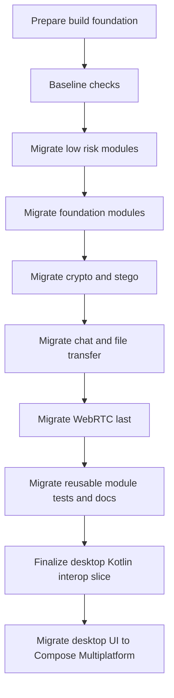
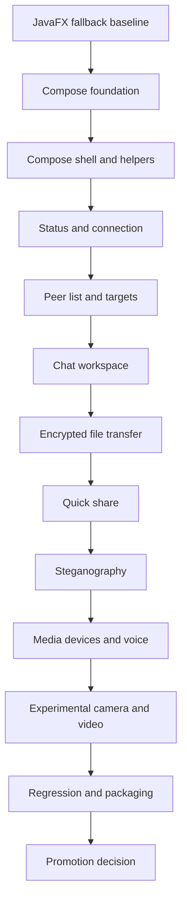

# Kotlin Migration Plan

## Scope

This plan records the completed Java-to-Kotlin migration for reusable core modules, the finalized desktop Kotlin interop slice, and the next desktop UI direction:

- [`modules/common-model`](../modules/common-model/build.gradle)
- [`modules/common-net`](../modules/common-net/build.gradle)
- [`modules/crypto-core`](../modules/crypto-core/build.gradle)
- [`modules/chat-core`](../modules/chat-core/build.gradle)
- [`modules/file-transfer-core`](../modules/file-transfer-core/build.gradle)
- [`modules/webrtc-core`](../modules/webrtc-core/build.gradle)
- [`modules/audio-core`](../modules/audio-core/build.gradle)
- [`modules/webcam-core`](../modules/webcam-core/build.gradle)
- [`modules/stego-core`](../modules/stego-core/build.gradle)

The desktop client in [`apps/desktop-client`](../apps/desktop-client/build.gradle) is assessed separately because it is an application module with JavaFX UI, packaging tasks, and the next planned UI migration to Compose Multiplatform.

The Android client in [`apps/android-client`](../apps/android-client/build.gradle) already uses Kotlin for production sources. Its protocol compatibility unit tests now also use the conventional Kotlin test source layout under [`apps/android-client/src/test/kotlin`](../apps/android-client/src/test/kotlin), preserving desktop-interoperability coverage for crypto payloads, UDP discovery payloads, and wire-message escaping.

## Current repository context

- The root build applies Java Library configuration to all non-Android subprojects in [`build.gradle`](../build.gradle:15).
- The current JVM baseline is Java 25 through [`languageVersion`](../build.gradle:21) and [`options.release`](../build.gradle:26).
- The Android client already uses Kotlin through [`org.jetbrains.kotlin.android`](../apps/android-client/build.gradle:3), with a JVM target configured in [`kotlinOptions`](../apps/android-client/build.gradle:53).
- The desktop client uses the Application plugin and JavaFX plugin in [`apps/desktop-client/build.gradle`](../apps/desktop-client/build.gradle:3).
- Desktop packaging uses [`jpackage`](../apps/desktop-client/build.gradle:80), [`buildPortable`](../apps/desktop-client/build.gradle:100), and [`buildExe`](../apps/desktop-client/build.gradle:158).
- The WebRTC module depends on [`webrtc-java`](../modules/webrtc-core/build.gradle:3), so it should be treated as a high-risk migration area.

## Target approach

Use a gradual mixed Java and Kotlin migration. Do not convert the whole repository at once. Keep each module buildable after every migration step and preserve existing public APIs unless an API change is reviewed explicitly.

```mermaid
flowchart TD
    A[Prepare build foundation] --> B[Baseline checks]
    B --> C[Migrate low risk modules]
    C --> D[Migrate foundation modules]
    D --> E[Migrate crypto and stego]
    E --> F[Migrate chat and file transfer]
    F --> G[Migrate WebRTC last]
    G --> H[Migrate reusable module tests and docs]
    H --> I[Finalize desktop Kotlin interop slice]
    I --> J[Migrate desktop UI to Compose Multiplatform]
```

## Migration phases

### Phase 0: Build foundation

- Add the Kotlin JVM plugin to the root build in a way that does not affect [`apps/android-client`](../apps/android-client/build.gradle).
- Keep Java Library configuration for JVM modules from [`build.gradle`](../build.gradle:15).
- Configure Kotlin JVM toolchains consistently with the Java 25 baseline from [`build.gradle`](../build.gradle:21).
- Verify that Kotlin compiler target settings are compatible with Java compile settings from [`build.gradle`](../build.gradle:25).
- Prefer centralized version management for Kotlin plugins so the Android and JVM sides do not drift unnecessarily.
- Keep the module graph in [`settings.gradle`](../settings.gradle:11) unchanged.

### Phase 1: Baseline validation

- Run a clean full build before migration.
- Record public API contracts for models, services, events, protocol classes, and exceptions.
- Run the desktop client through [`apps/desktop-client`](../apps/desktop-client/build.gradle).
- Build the Android debug APK through [`apps/android-client`](../apps/android-client/build.gradle).
- Keep the current protocol behavior unchanged for LAN discovery, chat handshake, file transfer, and RTC signaling.

Status: completed. The clean full build passed, Android debug assembly was covered by the full build, and the reusable module public API baseline is captured in [`docs/kotlin-api-baseline.md`](kotlin-api-baseline.md).

### Phase 2: Low-risk modules first

- Migrate [`modules/audio-core`](../modules/audio-core/build.gradle) first.
- Migrate [`modules/webcam-core`](../modules/webcam-core/build.gradle) second.
- Recheck module dependency rules before changing these modules, because current build files depend on [`modules/webrtc-core`](../modules/webrtc-core/build.gradle).
- Keep these modules small and profile-oriented; do not introduce UI code or Android-specific dependencies.

Status: completed. [`modules/audio-core`](../modules/audio-core/build.gradle) and [`modules/webcam-core`](../modules/webcam-core/build.gradle) now use Kotlin JVM and keep Java-callable record-style profile DTOs through Kotlin JVM records.

Compatibility note: Kotlin 2.2.21 does not yet emit JVM target 25 bytecode, so Kotlin JVM modules compile with JVM target 24 while the Java toolchain remains Java 25. The build explicitly ignores Kotlin/Java target validation for migrated JVM modules until Kotlin supports JVM target 25.

### Phase 3: Foundation modules

- Migrate [`modules/common-net`](../modules/common-net/build.gradle) before higher-level networking modules.
- Preserve socket lifecycle behavior, transport exceptions, text channels, frame channels, TCP server utilities, and UDP broadcast address resolution.
- Migrate [`modules/common-model`](../modules/common-model/build.gradle) carefully because it defines shared DTOs and events used across clients and core modules.
- Decide per model whether to keep Java records temporarily or replace them with Kotlin data classes after checking Java caller compatibility.
- Preserve RTC signaling payload behavior from the common model package.

Status: completed. [`modules/common-net`](../modules/common-net/build.gradle) and [`modules/common-model`](../modules/common-model/build.gradle) now use Kotlin JVM. Common model DTOs use Kotlin JVM records where the constructor contract is record-compatible; [`RtcSignalEnvelope`](../modules/common-model/src/main/kotlin/com/shterneregen/securelan/common/model/rtc/RtcSignalEnvelope.kt) remains a Java-callable Kotlin class to preserve null-normalization and factory behavior.

### Phase 4: Crypto and steganography

- Migrate [`modules/crypto-core`](../modules/crypto-core/build.gradle) only with strict test coverage for AES-GCM, RSA, hashing, signatures, key generation, key encoding, and file crypto workflows.
- Preserve byte-level behavior, exception semantics, and resource handling.
- Do not introduce coroutine-based crypto APIs unless a separate API design is approved.
- Migrate [`modules/stego-core`](../modules/stego-core/build.gradle) after crypto-core validation.
- Preserve BMP capacity checks, header layout, payload encoding, password-based encryption integration, and oversized payload behavior.

Status: completed. [`modules/crypto-core`](../modules/crypto-core/build.gradle) and [`modules/stego-core`](../modules/stego-core/build.gradle) now use Kotlin JVM. Crypto services preserve AES-GCM/RSA/signature/hash/key/file workflow behavior, while encrypted payload model classes remain defensive-copy Kotlin classes rather than JVM records. Steganography preserves BMP capacity/header/payload behavior and password encrypt-then-hide integration.

### Phase 5: Chat and file transfer

- Migrate [`modules/chat-core`](../modules/chat-core/build.gradle) after common-net and crypto-core are stable.
- Preserve UDP discovery wire format, handshake behavior, chat events, receive loops, service interfaces, and signaling transport.
- Migrate [`modules/file-transfer-core`](../modules/file-transfer-core/build.gradle) after transport and crypto APIs are stable.
- Preserve file metadata format, encrypted transfer handshake, progress events, acceptance handling, and integration tests.
- Avoid changing desktop and Android interoperability protocols during this phase.

Status: completed. [`modules/chat-core`](../modules/chat-core/build.gradle) and [`modules/file-transfer-core`](../modules/file-transfer-core/build.gradle) now use Kotlin JVM for main sources. UDP discovery, secure chat handshake, RTC signaling transport, file metadata serialization, encrypted file-transfer handshake, quick-share, acceptance handling, progress events, existing Java integration tests, and the full repository build are preserved.

### Phase 6: WebRTC last

- Migrate [`modules/webrtc-core`](../modules/webrtc-core/build.gradle) last.
- Start with small event classes, service interfaces, and configuration objects.
- Keep runtime-heavy code on Java until Kotlin interop with [`webrtc-java`](../modules/webrtc-core/build.gradle:3) callbacks is proven safe.
- Preserve diagnostics for provider initialization, SDP, ICE, media devices, audio levels, video frames, preview conversion, and runtime failures.
- Treat video-related code as experimental and avoid expanding scope during migration.

Status: partially completed. [`modules/webrtc-core`](../modules/webrtc-core/build.gradle) now uses Kotlin JVM for low-risk public event types, service interfaces, request/snapshot/device/status objects, `NoOpRtcEngine`, provider selection, file logging, video diagnostics, preview policy, default session orchestration in [`DefaultRtcSessionService`](../modules/webrtc-core/src/main/kotlin/com/shterneregen/securelan/webrtc/service/impl/DefaultRtcSessionService.kt), deterministic [`VideoCapabilitySelector`](../modules/webrtc-core/src/main/kotlin/com/shterneregen/securelan/webrtc/runtime/video/VideoCapabilitySelector.kt) capability-selection logic, and deterministic [`VideoFrameConverter`](../modules/webrtc-core/src/main/kotlin/com/shterneregen/securelan/webrtc/runtime/video/VideoFrameConverter.kt) I420-to-BGRA conversion. Coverage exists in [`DefaultRtcSessionServiceTest`](../modules/webrtc-core/src/test/kotlin/com/shterneregen/securelan/webrtc/service/impl/DefaultRtcSessionServiceTest.kt), [`VideoCapabilitySelectorTest`](../modules/webrtc-core/src/test/kotlin/com/shterneregen/securelan/webrtc/runtime/video/VideoCapabilitySelectorTest.kt), and [`VideoFrameConverterTest`](../modules/webrtc-core/src/test/kotlin/com/shterneregen/securelan/webrtc/runtime/video/VideoFrameConverterTest.kt). The callback-heavy [`WebRtcJavaEngine`](../modules/webrtc-core/src/main/java/com/shterneregen/securelan/webrtc/runtime/WebRtcJavaEngine.java), media device service, video capture/session/sink utilities remain Java to minimize risk around `webrtc-java` callback interop. Targeted validation passed with `gradlew.bat :modules:webrtc-core:test`; these Phase 9 migrations were compile-validated before broader test/build validation.

### Phase 7: Tests and documentation

- Migrate tests close to the corresponding production module, but do not rewrite tests and production behavior in the same large commit.
- Update [`README.md`](../README.md) if Kotlin becomes part of the official core stack.
- Update [`docs/development.md`](development.md) if build, run, or environment requirements change.
- Update packaging documentation if Kotlin runtime dependencies affect desktop distributions.

Status: completed for the reusable-module test and documentation migration scope. Remaining Java JUnit tests in migrated reusable modules were moved from `src/test/java` to `src/test/kotlin` without changing the covered protocol, crypto, stego, transport, chat, file-transfer, or quick-share behaviors. The public overview already lists Kotlin as part of the core stack, and [`docs/development.md`](development.md) now notes that Kotlin core sources and tests are built through Gradle with no separate local Kotlin installation required. Targeted validation passed with `gradlew.bat :modules:common-model:test :modules:common-net:test :modules:crypto-core:test :modules:stego-core:test :modules:chat-core:test :modules:file-transfer-core:test`.

### Phase 8: Desktop Kotlin interop slice (completed and closed)

Goal: add Kotlin JVM support to [`apps/desktop-client`](../apps/desktop-client/build.gradle) and extract low-risk desktop helpers without changing JavaFX behavior, LAN interoperability, or packaging configuration.

Finalized outcome:

- [`apps/desktop-client`](../apps/desktop-client/build.gradle) applies the Kotlin JVM plugin while keeping the JavaFX plugin, Application plugin, Java 25 toolchain, packaging tasks, dependency graph, and main-class configuration unchanged.
- The Java launcher [`Main.java`](../apps/desktop-client/src/main/java/com/shterneregen/securelan/desktop/Main.java) and JavaFX application boundary [`ChatApplication.java`](../apps/desktop-client/src/main/java/com/shterneregen/securelan/desktop/ChatApplication.java) remain in place so [`application.mainClass`](../apps/desktop-client/build.gradle:8), JAR manifest generation, and `jpackage` tasks continue to resolve `com.shterneregen.securelan.desktop.Main`.
- The public desktop `MainView` JVM class is provided by [`MainView.kt`](../apps/desktop-client/src/main/kotlin/com/shterneregen/securelan/desktop/ui/MainView.kt). It preserves JVM class identity `com.shterneregen.securelan.desktop.ui.MainView`, the no-argument constructor, and Java-callable `createContent()` / `shutdown()` lifecycle methods used by [`ChatApplication.java`](../apps/desktop-client/src/main/java/com/shterneregen/securelan/desktop/ChatApplication.java).
- The source-equivalent JavaFX implementation intentionally remains in package-private [`MainViewDelegate.java`](../apps/desktop-client/src/main/java/com/shterneregen/securelan/desktop/ui/MainViewDelegate.java). [`MainView.kt`](../apps/desktop-client/src/main/kotlin/com/shterneregen/securelan/desktop/ui/MainView.kt) is a Kotlin compatibility shell, not a completed JavaFX UI rewrite.
- Safe desktop slices extracted transfer, quick-share, realtime, peer, media-device, list-cell, and low-risk main-view helper logic to Kotlin helpers with desktop-client tests.
- The attempted duplicate desktop nickname service was removed in favor of the shared [`DefaultRandomNicknameService`](../modules/chat-core/src/main/kotlin/com/shterneregen/securelan/chat/service/impl/DefaultRandomNicknameService.kt) from chat-core.
- Recorded validation is limited to `gradlew.bat :apps:desktop-client:test :apps:desktop-client:build`.

Closed decision:

- Phase 8 is completed, finalized, and closed.
- Further migration of JavaFX UI panels, delegate logic, or the Java launcher to Kotlin will not continue under Phase 8.
- Remaining JavaFX-to-Kotlin panel/delegate checklist items are superseded by Phase 9, which changes the direction from JavaFX Kotlin conversion to a controlled Compose Multiplatform UI migration.
- No Phase 8 result claims desktop launch, portable ZIP, or Windows EXE validation beyond the documented `test` and `build` Gradle tasks.

Final Phase 8 acceptance criteria:

- [`gradlew.bat :apps:desktop-client:test`](../gradlew.bat) and [`gradlew.bat :apps:desktop-client:build`](../gradlew.bat) pass for the desktop interop slice.
- The desktop client remains an application boundary only; no reusable core module depends on [`apps/desktop-client`](../apps/desktop-client/build.gradle).
- No JavaFX code is moved into reusable core modules.
- The Java launcher, JavaFX application boundary, public Kotlin compatibility shell, and package-private JavaFX delegate boundaries are documented.

### Phase 9: Desktop UI migration to Compose Multiplatform (closed)

Goal: build a full Compose desktop UI that first becomes visually and functionally close to the current JavaFX workspace while preserving LAN interoperability, chat, encrypted file transfer, quick share, steganography, RTC signaling, voice, and experimental video/camera behavior.

Status: closed on 2026-06-11 as the initial Compose desktop parity implementation phase. The Compose shell, state contracts, host adapter, JavaFX-style workspace, peer list, shared chat, encrypted transfer surface, quick share, steganography, media/voice, experimental video controls, diagnostics/evidence cards, and JavaFX fallback guardrails exist under [`apps/desktop-client`](../apps/desktop-client/build.gradle). Follow-up runtime hardening, UX modernization, packaging validation, and launcher/fallback decisions are now tracked in [Phase 10](#phase-10-compose-runtime-stabilization-ux-modernization-and-release-readiness).

Architecture constraints:

- All Compose and remaining JavaFX UI code stays under [`apps/desktop-client`](../apps/desktop-client/build.gradle).
- Reusable modules remain UI-agnostic; do not move JavaFX or Compose code into [`modules`](../modules).
- Do not introduce Spring, Spring Boot, TornadoFX, an FXML redesign, a coroutines-first rewrite, or cyclic dependencies.
- Keep crypto, network, transport, file-transfer, steganography, and RTC provider/runtime logic behind existing service boundaries outside the UI.
- Keep RTC signaling routed through chat-core and treat voice as the primary stable realtime media flow; preserve video diagnostics and fallback behavior because camera/video remains experimental.

Coexistence strategy:

1. Keep the existing JavaFX UI as the stable baseline while Compose grows feature parity.
2. Build the Compose UI through explicit desktop-only screens, state models, and host adapters so service orchestration, protocol behavior, and reusable core APIs remain unchanged.
3. Fill the Compose UI feature by feature until it mirrors the JavaFX workspace: status, peer list, chat, transfers, quick share, steganography, media devices, voice, video, diagnostics, and fallback messaging.
4. Use deterministic tests for mapping/state and fix runtime issues through user-reported feedback instead of tracking a separate manual validation checklist here.
5. After the JavaFX-parity pass, modernize the Compose UX with cleaner layout, clearer actions, consistent states, and more user-friendly workflows.
6. Keep JavaFX screens available until the corresponding Compose replacement is accepted and reversible.
7. Promote Compose or remove JavaFX only after complete UI parity, UI stabilization, portable ZIP validation, and Windows EXE validation.

Final Phase 9 roadmap and checklist:

| Step | Status | UI parity scope | Implementation and validation checklist |
| --- | --- | --- | --- |
| 9.0 JavaFX fallback baseline | Done enough for planning; refresh evidence only when touching a feature. | Keep [`MainView.kt`](../apps/desktop-client/src/main/kotlin/com/shterneregen/securelan/desktop/ui/MainView.kt), [`MainViewDelegate.java`](../apps/desktop-client/src/main/java/com/shterneregen/securelan/desktop/ui/MainViewDelegate.java), [`Main.java`](../apps/desktop-client/src/main/java/com/shterneregen/securelan/desktop/Main.java), and [`ChatApplication.java`](../apps/desktop-client/src/main/java/com/shterneregen/securelan/desktop/ChatApplication.java) as the fallback boundary. | Document the JavaFX behavior for the feature being replaced; keep rollback limited to the current Compose slice; do not remove JavaFX fallback code. |
| 9.1 Compose build foundation | Done. | Compose Multiplatform is scoped to [`apps/desktop-client`](../apps/desktop-client/build.gradle) and does not replace the JavaFX packaged launcher. | Keep [`application.mainClass`](../apps/desktop-client/build.gradle:14) on JavaFX; keep [`runComposeShell`](../apps/desktop-client/build.gradle:48) as the experimental launcher; keep Application-plugin duplicate handling in [`distTar`](../apps/desktop-client/build.gradle:56), [`distZip`](../apps/desktop-client/build.gradle:60), and [`installDist`](../apps/desktop-client/build.gradle:64). |
| 9.2 Compose shell, theme, resources, and shared presentation helpers | Done. | Provide the desktop Compose shell, app theme, icon/resource strategy, preview metadata, diagnostics copy, and reusable UI-adjacent formatters. | Maintain [`ComposeDesktopMain.kt`](../apps/desktop-client/src/main/kotlin/com/shterneregen/securelan/desktop/compose/ComposeDesktopMain.kt), [`SecureLanComposeApp.kt`](../apps/desktop-client/src/main/kotlin/com/shterneregen/securelan/desktop/compose/SecureLanComposeApp.kt), [`SecureLanTheme.kt`](../apps/desktop-client/src/main/kotlin/com/shterneregen/securelan/desktop/compose/SecureLanTheme.kt), [`ComposeShellMetadata.kt`](../apps/desktop-client/src/main/kotlin/com/shterneregen/securelan/desktop/compose/ComposeShellMetadata.kt), [`ComposeDesktopResources.kt`](../apps/desktop-client/src/main/kotlin/com/shterneregen/securelan/desktop/compose/ComposeDesktopResources.kt), and desktop helper tests without changing protocol behavior. |
| 9.3 Status and connection controls | Done. | Compose can open a room, stop hosting, connect manually, disconnect, toggle discovery visibility, show status copy, show event feedback, and clean up shutdown state. | Validation recorded on 2026-05-25: [`gradlew.bat :apps:desktop-client:test :apps:desktop-client:build --no-daemon`](../gradlew.bat) passed and [`runComposeShell`](../apps/desktop-client/build.gradle:48) launched and exited successfully. No status polish is pending unless a regression appears. |
| 9.4 Peer list and target selection | Done and closed; network-environment hardening moved to Phase 10. | Compose shows discovered peers when callbacks arrive, provides manual peer targets when UDP broadcast is blocked, preserves selection by peer name after sorting/refresh, displays selected-peer metadata, exposes selected chat/file/voice/video/data target readiness, tracks connected chat-room peers from join/message/signal/leave events, filters out local/self rows, and avoids injecting the connected server as a fake peer. | Validation recorded on 2026-05-25: [`gradlew.bat :apps:desktop-client:test :apps:desktop-client:build --no-daemon`](../gradlew.bat) passed, [`runComposeShell`](../apps/desktop-client/build.gradle:48) launched successfully, and deterministic tests cover discovered-peer mapping, sorting, selection preservation, and selected target state. Validation recorded on 2026-06-11: [`gradlew.bat :apps:desktop-client:test --no-daemon`](../gradlew.bat) passed after JavaFX-compatible chat-peer tracking, local discovery filtering, and nickname propagation fixes. |
| 9.5 Chat workspace and interoperability | Done and closed for initial Compose parity; runtime smoke-test matrix moved to Phase 10. | Compose matches the JavaFX shared-room transcript/event mapping for connected, disconnected, received-message, join, left, and error lines; send readiness is guarded by live connection state and blank-message checks; Enter-to-send is supported; chat-header voice/video/end-call actions and a video-stage placeholder mirror the JavaFX workspace while RTC signaling remains routed through chat-core diagnostics without changing chat wire format. | Validation recorded on 2026-05-25: [`gradlew.bat :apps:desktop-client:test --no-daemon`](../gradlew.bat) passed. Validation recorded on 2026-06-11: [`gradlew.bat :apps:desktop-client:test --no-daemon`](../gradlew.bat) and [`gradlew.bat :apps:desktop-client:build --no-daemon`](../gradlew.bat) passed after chat-header and video-stage parity polish. Validation recorded on 2026-06-11: [`gradlew.bat :apps:desktop-client:test --no-daemon`](../gradlew.bat) passed after peer-list and Enter-send interop fixes. |
| 9.6 Encrypted file transfer | Done and closed for initial Compose parity; full receive-decision runtime parity and advanced controls moved to Phase 10. | Compose exposes incoming receive prompt copy, accept/decline decision recording, selected-peer send readiness, local listener readiness, outgoing file path/password inputs, auto-accept UI copy, progress rows, and started/progress/completed/failed event mapping while preserving metadata, prompt history, and crypto behavior. | Validation recorded on 2026-05-25: [`gradlew.bat :apps:desktop-client:test --no-daemon`](../gradlew.bat) passed for [`ComposeFileTransferState`](../apps/desktop-client/src/main/kotlin/com/shterneregen/securelan/desktop/compose/ComposeShellMetadata.kt), [`ComposeIncomingTransferPrompt`](../apps/desktop-client/src/main/kotlin/com/shterneregen/securelan/desktop/compose/ComposeShellMetadata.kt), and adapter event mapping. Validation recorded on 2026-06-11: [`gradlew.bat :apps:desktop-client:test --no-daemon`](../gradlew.bat) and [`gradlew.bat :apps:desktop-client:build --no-daemon`](../gradlew.bat) passed after auto-accept and prompt-control parity polish. |
| 9.7 Quick share | Done and closed for initial Compose parity; LAN hardening and runtime review moved to Phase 10. | Compose matches core quick-share status/start/stop, trusted-LAN warning, text and file share creation, visible share rows, copy-index action, landing URL copy, and LAN access diagnostics. | Validation recorded on 2026-05-25: [`gradlew.bat :apps:desktop-client:test --no-daemon`](../gradlew.bat) passed for [`ComposeQuickShareState`](../apps/desktop-client/src/main/kotlin/com/shterneregen/securelan/desktop/compose/ComposeShellMetadata.kt), [`ComposeDesktopHostAdapter`](../apps/desktop-client/src/main/kotlin/com/shterneregen/securelan/desktop/compose/ComposeDesktopHostAdapter.kt), and quick-share row/diagnostic mapping. Validation recorded on 2026-06-11: [`gradlew.bat :apps:desktop-client:test --no-daemon`](../gradlew.bat) and [`gradlew.bat :apps:desktop-client:build --no-daemon`](../gradlew.bat) passed after copy-index parity polish. |
| 9.8 Steganography | Done and closed for initial Compose parity; runtime visual review moved to Phase 10. | Compose exposes BMP inspect, hide, encrypted hide/extract, cover/input/output chooser UX, output path, JavaFX-aligned labels (`Cover BMP`, `Save as`, `Encrypt with password`, `Stego BMP`, `Clear`), status copy, extracted-message summary, and failure feedback without moving crypto/stego logic into composables. | Validation recorded on 2026-05-26: [`gradlew.bat :apps:desktop-client:test --no-daemon`](../gradlew.bat) passed for [`ComposeSteganographyState`](../apps/desktop-client/src/main/kotlin/com/shterneregen/securelan/desktop/compose/ComposeShellMetadata.kt), [`ComposeDesktopHostAdapter`](../apps/desktop-client/src/main/kotlin/com/shterneregen/securelan/desktop/compose/ComposeDesktopHostAdapter.kt), and live card compilation. Validation recorded on 2026-06-11: [`gradlew.bat :apps:desktop-client:test --no-daemon`](../gradlew.bat) and [`gradlew.bat :apps:desktop-client:build --no-daemon`](../gradlew.bat) passed after label/layout parity polish. |
| 9.9 Media devices and voice | Done and closed for initial Compose parity; cross-device voice stability hardening moved to Phase 10. | Compose exposes microphone device refresh, microphone chooser control, selected microphone labels, runtime status, voice readiness, start/stop controls, audio-level copy, fallback messaging, and diagnostics. | Validation recorded on 2026-05-26: [`gradlew.bat :apps:desktop-client:test --no-daemon`](../gradlew.bat) passed for [`ComposeMediaVoiceState`](../apps/desktop-client/src/main/kotlin/com/shterneregen/securelan/desktop/compose/ComposeShellMetadata.kt), RTC event/device adapter coverage, and live card compilation. Validation recorded on 2026-06-11: [`gradlew.bat :apps:desktop-client:test --no-daemon`](../gradlew.bat) and [`gradlew.bat :apps:desktop-client:build --no-daemon`](../gradlew.bat) passed after microphone chooser parity polish. |
| 9.10 Experimental camera and video | Done and closed for initial Compose parity; video remains experimental and stabilization moved to Phase 10. | Compose exposes camera device refresh, camera chooser control, camera test status, preview readiness, preview start/stop, experimental 1-to-1 video readiness, frame/status labels, fallback messaging, video-stage placeholder parity, and diagnostics. | Validation recorded on 2026-05-26: [`gradlew.bat :apps:desktop-client:test --no-daemon`](../gradlew.bat) passed for [`ComposeExperimentalVideoState`](../apps/desktop-client/src/main/kotlin/com/shterneregen/securelan/desktop/compose/ComposeShellMetadata.kt), camera preview adapter coverage, and live card compilation. Validation recorded on 2026-06-11: [`gradlew.bat :apps:desktop-client:test --no-daemon`](../gradlew.bat) and [`gradlew.bat :apps:desktop-client:build --no-daemon`](../gradlew.bat) passed after camera chooser and video-stage parity polish. |
| 9.11 Modern UX polish, diagnostics, and packaging readiness | Closed for Phase 9 scaffolding; product UX modernization and packaging validation moved to Phase 10. | Compose keeps visible diagnostics for network, discovery, file transfer, quick share, stego, RTC, media devices, audio levels, video frames, preview conversion, runtime failures, and fallback state while mirroring the JavaFX top status/header, advanced network panes, light/dark theme toggle, Peers/Chat/Actions workspace proportions, Actions-column default expansion model, compact section spacing, bordered rounded section headers, explicit expand/collapse chevrons, denser desktop typography, darker JavaFX-aligned shell colors, compact status chips, compact connection-header cards, collapsed manual peer fallback, dominant Chat transcript surface, compact JavaFX-style inline header fields, and reduced Selected peer / Transfers verbosity. | Validation recorded on 2026-05-26: [`gradlew.bat :apps:desktop-client:test --no-daemon`](../gradlew.bat) and [`gradlew.bat :apps:desktop-client:build --no-daemon`](../gradlew.bat) passed for [`ComposeJavaFxWorkspaceParityState`](../apps/desktop-client/src/main/kotlin/com/shterneregen/securelan/desktop/compose/ComposeShellMetadata.kt), the JavaFX-style Compose workspace shell in [`SecureLanComposeApp.kt`](../apps/desktop-client/src/main/kotlin/com/shterneregen/securelan/desktop/compose/SecureLanComposeApp.kt), and parity-layout tests. Additional validation recorded on 2026-05-27: [`gradlew.bat :apps:desktop-client:test --no-daemon`](../gradlew.bat) passed after Actions-column presentation-contract tests. Validation recorded on 2026-06-11: [`runComposeShell`](../apps/desktop-client/build.gradle:48) and JavaFX [`run`](../apps/desktop-client/build.gradle:13) were exercised for side-by-side runtime review at the 1360x860 baseline; [`gradlew.bat :apps:desktop-client:test --no-daemon`](../gradlew.bat) and [`gradlew.bat :apps:desktop-client:build --no-daemon`](../gradlew.bat) passed after the first parity-polish pass, Actions-column density polish, compact top-shell density polish, and visual parity completion pass. |
| 9.12 Compose promotion and JavaFX cleanup decision | Closed for Phase 9 guardrails only; final promotion decision moved to Phase 10. | Compose surfaces launcher-decision options, promotion decision steps, rollback copy, explicit approval blockers, packaging evidence records, and a copyable validation report, but Phase 9 made no launcher, manifest, jpackage main-class, or JavaFX removal changes. | Keep JavaFX as the packaged launcher until Phase 10 completes UI stabilization, rollback plan, portable ZIP validation, Windows EXE validation, and explicit promotion approval. |

```mermaid
flowchart TD
    A[JavaFX fallback baseline] --> B[Compose foundation]
    B --> C[Compose shell and helpers]
    C --> D[Status and connection]
    D --> E[Peer list and targets]
    E --> F[Chat workspace]
    F --> G[Encrypted file transfer]
    G --> H[Quick share]
    H --> I[Steganography]
    I --> J[Media devices and voice]
    J --> K[Experimental camera and video]
    K --> L[Regression and packaging]
    L --> M[Promotion decision]
```

Rollback and guardrails:

- Keep each Compose replacement behind a boundary that can switch back to the JavaFX baseline until the slice is accepted.
- Revert only the failed Compose slice and its adapters; do not roll back validated core-module Kotlin migration or unrelated reusable-module code.
- Do not change wire formats, ports, discovery payloads, encrypted transfer metadata, quick-share URLs, stego payload behavior, RTC signaling payloads, or media runtime provider behavior as part of UI migration.
- Treat packaging failures as release blockers for Compose-only UI promotion because Kotlin/Compose desktop dependencies may affect `jpackage`, portable ZIP contents, and WiX EXE generation.
- Keep diagnostics for network, file transfer, RTC provider initialization, SDP/ICE, media devices, audio levels, video frames, preview conversion, and runtime failures visible in the Compose UI before removing JavaFX equivalents.

Phase 9 closure criteria:

- Initial Compose implementations exist for every JavaFX workspace area in the Phase 9 scope.
- Each Phase 9 roadmap step has a clear UI boundary, deterministic validation evidence, and a rollback path through the JavaFX fallback.
- JavaFX remains the packaged launcher and stable fallback.
- LAN discovery, chat, encrypted file transfer, quick share, RTC signaling, voice, supported experimental video flows, and desktop-to-Android compatibility wire formats remain unchanged.
- Follow-up runtime hardening, UX modernization, packaging validation, and launcher promotion are explicitly deferred to Phase 10 instead of blocking Phase 9 closure.
- Reusable modules stay UI-agnostic, dependency directions remain acyclic, and no framework or architecture outside the approved Compose desktop direction was introduced.

### Phase 10: Compose runtime stabilization, UX modernization, and release readiness

Goal: turn the Phase 9 Compose shell from an experimental parity implementation into a release-ready desktop UI candidate through runtime hardening, user-friendly UX improvements, packaging validation, and an explicit launcher/fallback decision.

Phase 10 scope carries forward every unfinished Phase 9 item plus the gaps found during the 2026-06-11 JavaFX/Compose interop review:

| Step | Status | Scope | Implementation and validation checklist |
| --- | --- | --- | --- |
| 10.0 Runtime parity review matrix | Planned. | Re-run side-by-side JavaFX and Compose review for the full workspace at the 1360x860 baseline and common resized desktop sizes. | Capture screenshot/runtime evidence for My profile, Manual connection, Peers, Chat, Selected peer, Transfers, Quick share, Steganography, Audio / Video devices, Runtime / Diagnostics, light/dark theme, empty/loading/error/disabled states, and long-content scrolling. |
| 10.1 Desktop-to-desktop interop smoke tests | Planned. | Validate old UI server ↔ new UI client and new UI server ↔ old UI client behavior. | Confirm peer list rows show connected clients rather than self/server entries, custom/random nicknames propagate instead of default preview names, Enter sends chat messages, disconnect/left state is reflected, and shared-room transcript order matches JavaFX. |
| 10.2 Desktop-to-Android interop regression | Planned. | Re-check Android MVP compatibility after Compose desktop runtime changes. | Validate LAN discovery, secure chat, encrypted file send/receive, transfer progress, dark/light behavior where relevant, and diagnostics logs without changing protocol formats. |
| 10.3 LAN discovery and network hardening | Planned. | Harden discovery behavior for firewalls, VPNs, multi-adapter hosts, loopback/self filtering, duplicate announcements, and complex LANs. | Preserve UDP discovery payload compatibility; add diagnostics that distinguish listen-only, hidden, blocked broadcast, stale peer expiry, self-filtering, and manual-peer fallback. |
| 10.4 File-transfer runtime parity | Planned. | Close the gap where Compose receive prompts currently record deterministic decisions but do not fully match JavaFX runtime receive/accept workflows. | Validate incoming prompt UX, accept/decline side effects, auto-accept behavior, unknown/offline sender rejection, selected-peer send targeting, listener port selection, failed transfer recovery, and advanced transfer controls that JavaFX exposes or implies. |
| 10.5 Quick-share trusted-LAN hardening | Planned. | Runtime-test quick-share browser links and LAN access behavior beyond deterministic state rows. | Validate start/stop, copy index, text/file links, expiration/access limits, remote LAN access diagnostics, stopped/expired rows, and trusted-LAN warning clarity. |
| 10.6 Realtime voice/video stabilization | Planned. | Preserve voice as the primary stable realtime flow and keep video experimental while improving diagnostics. | Validate microphone/camera selection, preview start/stop, voice call start/end, SDP/ICE signaling diagnostics, audio levels, frame/status labels, runtime failure recovery, and cross-device behavior. |
| 10.7 User-friendly Compose UX modernization | Planned after parity acceptance. | Modernize beyond JavaFX without inventing protocol behavior: clearer navigation, consistent controls, better status feedback, better empty/error/loading states, less visual noise, and more discoverable primary actions. | Keep desktop density, resizable layout quality, accessible labels, keyboard behavior including Enter-to-send, hover/selected/disabled states, and visible diagnostics. |
| 10.8 Packaging validation | Planned. | Validate Compose runtime dependencies in desktop distributions while JavaFX remains fallback until promotion is approved. | Run and record [`gradlew.bat :apps:desktop-client:buildPortable --no-daemon`](../gradlew.bat), [`gradlew.bat :apps:desktop-client:buildExe --no-daemon`](../gradlew.bat) or [`gradlew.bat :apps:desktop-client:createExe --no-daemon`](../gradlew.bat) on WiX-enabled Windows, and smoke-launch produced artifacts. |
| 10.9 Promotion and JavaFX cleanup decision | Planned. | Decide whether to keep JavaFX fallback, promote Compose launcher, or remove unused JavaFX paths. | Require accepted runtime matrix, UX stabilization, rollback plan, portable ZIP validation, Windows EXE validation, explicit approval, and no unresolved protocol/interoperability regressions before changing [`application.mainClass`](../apps/desktop-client/build.gradle:14), manifest, jpackage main class, or JavaFX files. |

## Pros of moving from Java to Kotlin

- Less boilerplate in models, events, request objects, and tests.
- Stronger null-safety at compile time for network responses, optional runtime state, selected peers, session state, and UI adapters.
- More concise immutable models through data classes where API compatibility allows them.
- Better alignment with the existing Android client, which is already Kotlin-based in [`apps/android-client`](../apps/android-client/build.gradle).
- Easier mapper and adapter code for shared protocol compatibility between desktop and Android.
- Gradual migration is possible because Java and Kotlin interoperate on the JVM.
- Test fixtures and small service implementations can become easier to read.

## Cons and risks of moving from Java to Kotlin

- Build configuration becomes more complex because JVM modules need Kotlin plugin and toolchain setup.
- Kotlin compiler target compatibility with Java 25 must be verified before adopting Kotlin across all core modules.
- Mixed Java and Kotlin builds can fail if Java and Kotlin target settings drift.
- Public API compatibility may change, especially if Java records are replaced by Kotlin data classes.
- Desktop packaging must include Kotlin runtime dependencies in the runtime classpath used by [`jpackage`](../apps/desktop-client/build.gradle:80).
- Compile time may increase.
- Kotlin interop with callback-heavy Java APIs can be less obvious in [`modules/webrtc-core`](../modules/webrtc-core/build.gradle).
- Crypto, protocol, and transfer modules are sensitive to subtle behavior changes from automatic conversion.
- The project gains a second JVM language in core modules, increasing review and maintenance requirements.

## Desktop client Kotlin assessment

The desktop client Kotlin interop work is finalized as Phase 8. Kotlin is enabled in the desktop module, low-risk helpers have been extracted, and the public `MainView` JVM class is provided by [`MainView.kt`](../apps/desktop-client/src/main/kotlin/com/shterneregen/securelan/desktop/ui/MainView.kt). The large JavaFX implementation remains intentionally isolated in package-private [`MainViewDelegate.java`](../apps/desktop-client/src/main/java/com/shterneregen/securelan/desktop/ui/MainViewDelegate.java). Further JavaFX panel/delegate migration to Kotlin is no longer planned; the next direction is Phase 9 migration to Compose Multiplatform.

### Current desktop boundary

- [`Main.java`](../apps/desktop-client/src/main/java/com/shterneregen/securelan/desktop/Main.java) remains the Application-plugin, manifest, and packaging launcher.
- [`ChatApplication.java`](../apps/desktop-client/src/main/java/com/shterneregen/securelan/desktop/ChatApplication.java) remains Java and constructs the Kotlin-backed public `MainView` class.
- [`MainView.kt`](../apps/desktop-client/src/main/kotlin/com/shterneregen/securelan/desktop/ui/MainView.kt) is a Kotlin compatibility shell that delegates to [`MainViewDelegate.java`](../apps/desktop-client/src/main/java/com/shterneregen/securelan/desktop/ui/MainViewDelegate.java).
- Existing Kotlin desktop helpers include models, formatter files, list cells, and low-risk main-view helper functions under [`apps/desktop-client/src/main/kotlin/com/shterneregen/securelan/desktop/ui`](../apps/desktop-client/src/main/kotlin/com/shterneregen/securelan/desktop/ui).

### Why Phase 8 does not continue

- JavaFX listeners, properties, overloaded methods, and nullable UI state would require careful Kotlin interop without moving the product toward the new UI target.
- The desktop client depends on almost every reusable module through [`apps/desktop-client/build.gradle`](../apps/desktop-client/build.gradle:21), so core API churn would affect it heavily.
- Packaging tasks depend on main JAR naming, runtime classpath, and main class configuration in [`apps/desktop-client/build.gradle`](../apps/desktop-client/build.gradle:42).
- Realtime voice/video and camera-preview UI paths remain higher risk because they depend on callback-heavy runtime state and experimental video diagnostics.
- Continuing JavaFX-to-Kotlin panel conversion would duplicate effort now superseded by the Compose Multiplatform migration plan.

### Recommended desktop path

- Keep the current JavaFX UI and Java launcher as the stable baseline while Phase 9 adds Compose Multiplatform behind desktop-only boundaries.
- Migrate screens in the deterministic Phase 9 order: app shell/theme/resources, status/connection controls, peer list, chat workspace, file transfer, quick share, steganography, media devices/voice, and experimental camera/video last.
- Preserve current service orchestration, resource loading behavior where needed, and protocol compatibility during each Compose slice.
- Handle runtime problems as user-reported issue-driven fixes rather than as a separate manual validation checklist in this plan.
- After Compose closely matches JavaFX, modernize the UI to be cleaner, more discoverable, and more user friendly before any launcher promotion decision.
- Change or remove JavaFX launcher/UI infrastructure only after Compose parity, UI stabilization, and packaging validation are complete.

## Acceptance criteria

- Full build succeeds from the repository root.
- Desktop client launches successfully.
- Android debug APK builds successfully.
- Unit and integration tests pass for every migrated module.
- UDP discovery, secure chat handshake, encrypted file transfer, RTC signaling, and desktop Android interoperability stay compatible.
- Public module dependency directions remain acyclic and aligned with architecture rules.
- Portable ZIP packaging through [`buildPortable`](../apps/desktop-client/build.gradle:100) still includes all required runtime dependencies.
- Windows EXE packaging through [`buildExe`](../apps/desktop-client/build.gradle:158) still works on a WiX-enabled Windows environment.
- Documentation is updated where the official language stack, build process, or product status changes.

## Implementation checklist

- [x] Add Kotlin JVM plugin setup for JVM modules without changing Android plugin behavior.
- [x] Verify Kotlin plugin resolution with Gradle 9.1 or newer and the existing Android Kotlin version.
- [x] Configure Kotlin JVM toolchain consistently with the Java 25 toolchain.
- [x] Run Phase 1 clean full build baseline validation.
- [x] Capture reusable module public API baseline in [`docs/kotlin-api-baseline.md`](kotlin-api-baseline.md).
- [x] Enable Kotlin in one low-risk JVM module first.
- [x] Migrate [`modules/audio-core`](../modules/audio-core/build.gradle) and validate the full build.
- [x] Migrate [`modules/webcam-core`](../modules/webcam-core/build.gradle) and validate the full build.
- [x] Migrate [`modules/common-net`](../modules/common-net/build.gradle) and validate transport tests.
- [x] Review the public API strategy for [`modules/common-model`](../modules/common-model/build.gradle).
- [x] Migrate [`modules/common-model`](../modules/common-model/build.gradle) without breaking Java callers.
- [x] Migrate [`modules/crypto-core`](../modules/crypto-core/build.gradle) with byte-level behavior tests.
- [x] Migrate [`modules/stego-core`](../modules/stego-core/build.gradle) after crypto validation.
- [x] Migrate [`modules/chat-core`](../modules/chat-core/build.gradle) and run chat integration tests.
- [x] Migrate [`modules/file-transfer-core`](../modules/file-transfer-core/build.gradle) and run file transfer integration tests.
- [x] Migrate low-risk parts of [`modules/webrtc-core`](../modules/webrtc-core/build.gradle).
- [x] Decide whether high-risk WebRTC runtime implementation should remain Java.
- [x] Migrate reusable module tests to Kotlin test sources.
- [x] Add Kotlin JVM support to [`apps/desktop-client`](../apps/desktop-client/build.gradle) without breaking JavaFX run or packaging tasks.
- [x] Migrate desktop non-UI services before JavaFX UI code.
- [x] Extract small helpers and panel-level boundaries from the desktop main view before converting the public `MainView` shell.
- [x] Replace the public desktop `MainView` source with [`MainView.kt`](../apps/desktop-client/src/main/kotlin/com/shterneregen/securelan/desktop/ui/MainView.kt), preserving JVM class identity and Java-callable lifecycle methods through a package-private [`MainViewDelegate.java`](../apps/desktop-client/src/main/java/com/shterneregen/securelan/desktop/ui/MainViewDelegate.java).
- [x] Close Phase 8 without further migration of package-private JavaFX UI delegate/panels to Kotlin; this work is superseded by Phase 9 Compose Multiplatform migration.
- [x] Keep the desktop launcher in Java for the finalized Phase 8 interop slice; launcher changes are deferred until Phase 9 runtime and packaging validation justify them.
- [x] Move Android client Kotlin protocol compatibility tests from the Java test source tree to [`apps/android-client/src/test/kotlin`](../apps/android-client/src/test/kotlin) without changing tested desktop-interoperability behavior.
- [x] Update [`README.md`](../README.md) and [`docs/development.md`](development.md) if the official stack or build flow changes.
 
## Phase 9 working checklist

Phase 9 is closed. The active desktop UI checklist is now [Phase 10: Compose runtime stabilization, UX modernization, and release readiness](#phase-10-compose-runtime-stabilization-ux-modernization-and-release-readiness). Keep future desktop Compose status changes there only, so the plan and checklist do not drift or duplicate each other.

## Recommended next decision

Focus next on Phase 10: runtime interop smoke tests, network/file-transfer/realtime hardening, user-friendly Compose UX modernization, portable ZIP and Windows EXE validation, and then an explicit launcher/fallback decision.
