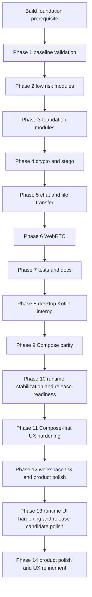

# Kotlin Migration Plan

## Scope

This plan records the completed Java-to-Kotlin migration for reusable core modules, the finalized desktop Kotlin interop slice, the completed Compose runtime and workspace hardening phases, and the active Phase 14 product-polish work. It also tracks post-migration Kotlin/Java interoperability changes that affect the migration exit criteria, such as protocol capability metadata, Compose packaging, Android interoperability, and remaining Java callback boundaries.

Reusable core module scope:

- [`modules/common-model`](../../modules/common-model/build.gradle)
- [`modules/common-net`](../../modules/common-net/build.gradle)
- [`modules/crypto-core`](../../modules/crypto-core/build.gradle)
- [`modules/chat-core`](../../modules/chat-core/build.gradle)
- [`modules/file-transfer-core`](../../modules/file-transfer-core/build.gradle)
- [`modules/webrtc-core`](../../modules/webrtc-core/build.gradle)
- [`modules/audio-core`](../../modules/audio-core/build.gradle)
- [`modules/webcam-core`](../../modules/webcam-core/build.gradle)
- [`modules/stego-core`](../../modules/stego-core/build.gradle)

Application-module scope:

- [`apps/desktop-client`](../../apps/desktop-client/build.gradle) is tracked through the desktop Kotlin interop, Compose release-readiness, workspace hardening, and active Phase 14 product-polish work.
- [`apps/android-client`](../../apps/android-client/build.gradle) already uses Kotlin for production sources and keeps protocol compatibility tests under [`apps/android-client/src/test/kotlin`](../../apps/android-client/src/test/kotlin).

Detailed phase records now live in [`phase-1.md`](phase-1.md) through [`phase-14.md`](phase-14.md). The original build-foundation Phase 0 is preserved as the build foundation prerequisite inside [`phase-1.md`](phase-1.md#build-foundation-prerequisite) so the documentation set uses the requested phase file range.

## Current repository context

- The root build applies Java Library configuration to all non-Android subprojects in [`build.gradle`](../../build.gradle).
- The current JVM baseline is Java 25 through [`languageVersion`](../../build.gradle) and [`options.release`](../../build.gradle).
- Kotlin JVM modules currently compile with JVM target 24 while the Java toolchain remains Java 25.
- The Android client uses [`org.jetbrains.kotlin.android`](../../apps/android-client/build.gradle), with a JVM target configured in [`kotlinOptions`](../../apps/android-client/build.gradle).
- The desktop client uses the Kotlin JVM, Compose, Application, and packaging plugins in [`apps/desktop-client/build.gradle`](../../apps/desktop-client/build.gradle).
- Desktop packaging uses `jpackage` through `buildPortable`, `buildComposePortable`, and `buildExe`.
- Compose is the active desktop UI and launcher; the obsolete JavaFX workspace-parity layer has been removed.
- Desktop Compose runtime work now uses Kotlin coroutines inside [`apps/desktop-client`](../../apps/desktop-client/build.gradle) for non-blocking file-transfer work; this is intentionally kept out of reusable modules unless a separate API design is approved.
- Chat handshake and peer presence now carry capability metadata through [`PeerCapabilities.kt`](../../modules/chat-core/src/main/kotlin/com/shterneregen/securelan/chat/protocol/handshake/PeerCapabilities.kt), while compatibility constructors preserve older Java/Kotlin call sites.
- The WebRTC module depends on [`webrtc-java`](../../modules/webrtc-core/build.gradle), so callback-heavy runtime code remains a high-risk migration area.

## Target approach

Use a gradual mixed Java and Kotlin migration. Do not convert the whole repository at once. Keep each module buildable after every migration step and preserve existing public APIs unless an API change is reviewed explicitly.

## Phase index

| Phase    | Status               | Summary                                                                                                                                                                                                                                                                                                                | Detailed record              |
|----------|----------------------|------------------------------------------------------------------------------------------------------------------------------------------------------------------------------------------------------------------------------------------------------------------------------------------------------------------------|------------------------------|
| Phase 1  | Completed            | Build foundation prerequisite plus baseline validation: Kotlin JVM setup strategy, clean full build, public API baseline, desktop/Android baseline checks, and protocol compatibility guardrails.                                                                                                                      | [`phase-1.md`](phase-1.md)   |
| Phase 2  | Completed            | Low-risk [`audio-core`](../../modules/audio-core/build.gradle) and [`webcam-core`](../../modules/webcam-core/build.gradle) migration to Kotlin JVM with Java-callable profile DTO contracts.                                                                                                                           | [`phase-2.md`](phase-2.md)   |
| Phase 3  | Completed            | Foundation [`common-net`](../../modules/common-net/build.gradle) and [`common-model`](../../modules/common-model/build.gradle) migration while preserving transport behavior and shared DTO/RTC payload compatibility.                                                                                                 | [`phase-3.md`](phase-3.md)   |
| Phase 4  | Completed            | [`crypto-core`](../../modules/crypto-core/build.gradle) and [`stego-core`](../../modules/stego-core/build.gradle) migration with byte-level crypto and BMP steganography behavior preserved.                                                                                                                           | [`phase-4.md`](phase-4.md)   |
| Phase 5  | Completed            | [`chat-core`](../../modules/chat-core/build.gradle) and [`file-transfer-core`](../../modules/file-transfer-core/build.gradle) migration while preserving UDP discovery, secure chat, RTC signaling transport, quick share, and encrypted transfer behavior.                                                            | [`phase-5.md`](phase-5.md)   |
| Phase 6  | Partially completed  | Low-risk [`webrtc-core`](../../modules/webrtc-core/build.gradle) events, services, orchestration, diagnostics, capability selection, and frame conversion migrated; callback-heavy runtime code remains Java.                                                                                                          | [`phase-6.md`](phase-6.md)   |
| Phase 7  | Completed            | Reusable-module tests and documentation moved to Kotlin test sources where appropriate, with development docs updated for Kotlin/Gradle validation.                                                                                                                                                                    | [`phase-7.md`](phase-7.md)   |
| Phase 8  | Completed and closed | Desktop Kotlin interop slice: Kotlin JVM enabled in [`apps/desktop-client`](../../apps/desktop-client/build.gradle), public [`MainView.kt`](../../apps/javafx-client/src/main/kotlin/com/shterneregen/securelan/desktop/ui/MainView.kt) compatibility shell added, JavaFX delegate and launcher boundaries preserved.  | [`phase-8.md`](phase-8.md)   |
| Phase 9  | Closed               | Initial Compose desktop parity implementation: Compose shell, host adapter, JavaFX-style workspace, feature surfaces, diagnostics, and fallback guardrails exist while JavaFX remains packaged launcher.                                                                                                               | [`phase-9.md`](phase-9.md)   |
| Phase 10 | Closed               | Compose runtime stabilization baseline, capability-aware desktop/Android peer targeting, UX modernization start, packaging readiness model, rollback planning, and explicit decision to keep JavaFX as deprecated packaged fallback.                                                                                   | [`phase-10.md`](phase-10.md) |
| Phase 11 | Completed            | Compose-first desktop UX hardening: JavaFX deprecated for new UI work; improve Compose navigation, peer-list states, chat, file transfer, session settings, diagnostics, errors, and release-gate evidence.                                                                                                            | [`phase-11.md`](phase-11.md) |
| Phase 12 | Completed            | Workspace UX and product polish: single contextual workspace, motion, microinteractions, empty states, visual polish, and consistency review.                                                                                                                                                                          | [`phase-12.md`](phase-12.md) |
| Phase 13 | Completed            | Runtime UI hardening and release-candidate polish driven by screenshot review: focus-ring halo, composer clipping, connection-hub compaction, Context Assistant runtime density, attachment ergonomics, resize matrix, and release gates.                                                                              | [`phase-13.md`](phase-13.md) |
| Phase 14 | In progress          | Product polish and UX refinement: call controls, focused Context Assistant modes, dedicated Quick Share/Steganography/Settings windows, video-stage ergonomics, transcript events, adaptive columns, and final consistency validation.                                                                                 | [`phase-14.md`](phase-14.md) |

## Kotlin migration trade-offs

### Pros

- Less boilerplate in models, events, request objects, and tests.
- Stronger null-safety at compile time for network responses, optional runtime state, selected peers, session state, and UI adapters.
- More concise immutable models through data classes where API compatibility allows them.
- Better alignment with the existing Android client, which is already Kotlin-based in [`apps/android-client`](../../apps/android-client/build.gradle).
- Easier mapper and adapter code for shared protocol compatibility between desktop and Android.
- Gradual migration is possible because Java and Kotlin interoperate on the JVM.
- Test fixtures and small service implementations can become easier to read.

### Cons and risks

- Build configuration becomes more complex because JVM modules need Kotlin plugin and toolchain setup.
- Kotlin compiler target compatibility with Java 25 must be verified before adopting Kotlin across all core modules.
- Mixed Java and Kotlin builds can fail if Java and Kotlin target settings drift.
- Public API compatibility may change, especially if Java records are replaced by Kotlin data classes.
- Desktop packaging must include Kotlin runtime dependencies in the runtime classpath used by [`jpackage`](../../apps/desktop-client/build.gradle).
- Compile time may increase.
- Kotlin interop with callback-heavy Java APIs can be less obvious in [`modules/webrtc-core`](../../modules/webrtc-core/build.gradle).
- Crypto, protocol, and transfer modules are sensitive to subtle behavior changes from automatic conversion.
- The project gains a second JVM language in core modules, increasing review and maintenance requirements.
- Adding Kotlin protocol models after the core migration can still change Java source/binary expectations; compatibility constructors and Java-style accessors must be preserved for shared handshake/request/event types.
- Compose runtime dependencies, including coroutine dependencies, remain packaging-sensitive and must be validated in portable and installer artifacts.

## Acceptance criteria

- Full build succeeds from the repository root.
- Desktop client launches successfully.
- Android debug APK builds successfully.
- Unit and integration tests pass for every migrated module.
- UDP discovery, secure chat handshake, encrypted file transfer, RTC signaling, and desktop Android interoperability stay compatible.
- Public module dependency directions remain acyclic and aligned with architecture rules.
- Portable ZIP packaging through `buildPortable` and `buildComposePortable` includes all required Kotlin, coroutine, and Compose runtime dependencies.
- Windows EXE packaging through [`buildExe`](../../apps/desktop-client/build.gradle) still works on a WiX-enabled Windows environment.
- Documentation is updated where the official language stack, build process, or product status changes.

## Recommended next decision

Finish the active Phase 14 consistency pass in [`phase-14.md`](phase-14.md): validate the dedicated Quick Share window, call-focused Context Assistant, adaptive side columns, video overlay/full-window controls, structured transcript events, keyboard traversal, and the runtime screenshot matrix before packaging.
