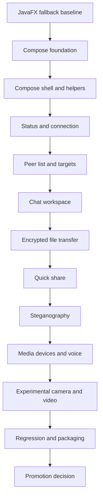

# Phase 9: Desktop UI migration to Compose Multiplatform (closed)

[Back to Kotlin Migration Plan](kotlin-migration.md#phase-index)

Goal: build a full Compose desktop UI that first becomes visually and functionally close to the current JavaFX workspace while preserving LAN interoperability, chat, encrypted file transfer, quick share, steganography, RTC signaling, voice, and experimental video/camera behavior.

Status: closed on 2026-06-11 as the initial Compose desktop parity implementation phase. The Compose shell, state contracts, host adapter, JavaFX-style workspace, peer list, shared chat, encrypted transfer surface, quick share, steganography, media/voice, experimental video controls, diagnostics/evidence cards, and JavaFX fallback guardrails exist under [`apps/desktop-client`](../../apps/desktop-client/build.gradle). Follow-up runtime hardening, UX modernization, packaging validation, and launcher/fallback decisions are tracked in the desktop-specific checklist: [`phase-10.md`](phase-10.md#remaining-checklist-for-full-kotlin-compose-ui-implementation).

Architecture constraints:

- All Compose and remaining JavaFX UI code stays under [`apps/desktop-client`](../../apps/desktop-client/build.gradle).
- Reusable modules remain UI-agnostic; do not move JavaFX or Compose code into [`modules`](../../modules).
- Do not introduce Spring, Spring Boot, TornadoFX, an FXML redesign, a coroutines-first rewrite, or cyclic dependencies.
- Keep crypto, network, transport, file-transfer, steganography, and RTC provider/runtime logic behind existing service boundaries outside the UI.
- Keep RTC signaling routed through chat-core and treat voice as the primary stable realtime media flow; preserve video diagnostics and fallback behavior because camera/video remains experimental.

Coexistence strategy:

1. Keep the existing JavaFX UI as the stable baseline while Compose grows feature parity.
2. Build the Compose UI through explicit desktop-only screens, state models, and host adapters so service orchestration, protocol behavior, and reusable core APIs remain unchanged.
3. Fill the Compose UI feature by feature until it mirrors the JavaFX workspace: status, peer list, chat, transfers, quick share, steganography, media devices, voice, video, diagnostics, and fallback messaging.
4. Use deterministic tests for mapping/state and fix runtime issues through user-reported feedback instead of tracking a separate manual validation checklist here.
5. After the JavaFX-parity pass, modernize the Compose UX with cleaner layout, clearer actions, consistent states, and more user-friendly workflows.
6. Keep JavaFX screens available until the corresponding Compose replacement is accepted and reversible.
7. Promote Compose or remove JavaFX only after complete UI parity, UI stabilization, portable ZIP validation, and Windows EXE validation.

Final Phase 9 roadmap and checklist:

| Step | Status | UI parity scope | Implementation and validation checklist |
| --- | --- | --- | --- |
| 9.0 JavaFX fallback baseline | Done enough for planning; refresh evidence only when touching a feature. | Keep [`MainView.kt`](../../apps/desktop-client/src/main/kotlin/com/shterneregen/securelan/desktop/ui/MainView.kt), [`MainViewDelegate.java`](../../apps/desktop-client/src/main/java/com/shterneregen/securelan/desktop/ui/MainViewDelegate.java), [`Main.java`](../../apps/desktop-client/src/main/java/com/shterneregen/securelan/desktop/Main.java), and [`ChatApplication.java`](../../apps/desktop-client/src/main/java/com/shterneregen/securelan/desktop/ChatApplication.java) as the fallback boundary. | Document the JavaFX behavior for the feature being replaced; keep rollback limited to the current Compose slice; do not remove JavaFX fallback code. |
| 9.1 Compose build foundation | Done. | Compose Multiplatform is scoped to [`apps/desktop-client`](../../apps/desktop-client/build.gradle) and does not replace the JavaFX packaged launcher. | Keep [`application.mainClass`](../../apps/desktop-client/build.gradle:14) on JavaFX; keep [`runComposeShell`](../../apps/desktop-client/build.gradle:48) as the experimental launcher; keep Application-plugin duplicate handling in [`distTar`](../../apps/desktop-client/build.gradle:56), [`distZip`](../../apps/desktop-client/build.gradle:60), and [`installDist`](../../apps/desktop-client/build.gradle:64). |
| 9.2 Compose shell, theme, resources, and shared presentation helpers | Done. | Provide the desktop Compose shell, app theme, icon/resource strategy, preview metadata, diagnostics copy, and reusable UI-adjacent formatters. | Maintain [`ComposeDesktopMain.kt`](../../apps/desktop-client/src/main/kotlin/com/shterneregen/securelan/desktop/compose/ComposeDesktopMain.kt), [`SecureLanComposeApp.kt`](../../apps/desktop-client/src/main/kotlin/com/shterneregen/securelan/desktop/compose/SecureLanComposeApp.kt), [`SecureLanTheme.kt`](../../apps/desktop-client/src/main/kotlin/com/shterneregen/securelan/desktop/compose/SecureLanTheme.kt), [`ComposeShellMetadata.kt`](../../apps/desktop-client/src/main/kotlin/com/shterneregen/securelan/desktop/compose/ComposeShellMetadata.kt), [`ComposeDesktopResources.kt`](../../apps/desktop-client/src/main/kotlin/com/shterneregen/securelan/desktop/compose/ComposeDesktopResources.kt), and desktop helper tests without changing protocol behavior. |
| 9.3 Status and connection controls | Done. | Compose can open a room, stop hosting, connect manually, disconnect, toggle discovery visibility, show status copy, show event feedback, and clean up shutdown state. | Validation recorded on 2026-05-25: [`gradlew.bat :apps:desktop-client:test :apps:desktop-client:build --no-daemon`](../../gradlew.bat) passed and [`runComposeShell`](../../apps/desktop-client/build.gradle:48) launched and exited successfully. No status polish is pending unless a regression appears. |
| 9.4 Peer list and target selection | Done and closed; network-environment hardening moved to Phase 10. | Compose shows discovered peers when callbacks arrive, provides manual peer targets when UDP broadcast is blocked, preserves selection by peer name after sorting/refresh, displays selected-peer metadata, exposes selected chat/file/voice/video/data target readiness, tracks connected chat-room peers from join/message/signal/leave events, filters out local/self rows, and avoids injecting the connected server as a fake peer. | Validation recorded on 2026-05-25: [`gradlew.bat :apps:desktop-client:test :apps:desktop-client:build --no-daemon`](../../gradlew.bat) passed, [`runComposeShell`](../../apps/desktop-client/build.gradle:48) launched successfully, and deterministic tests cover discovered-peer mapping, sorting, selection preservation, and selected target state. Validation recorded on 2026-06-11: [`gradlew.bat :apps:desktop-client:test --no-daemon`](../../gradlew.bat) passed after JavaFX-compatible chat-peer tracking, local discovery filtering, and nickname propagation fixes. |
| 9.5 Chat workspace and interoperability | Done and closed for initial Compose parity; runtime smoke-test matrix moved to Phase 10. | Compose matches the JavaFX shared-room transcript/event mapping for connected, disconnected, received-message, join, left, and error lines; send readiness is guarded by live connection state and blank-message checks; Enter-to-send is supported; chat-header voice/video/end-call actions and a video-stage placeholder mirror the JavaFX workspace while RTC signaling remains routed through chat-core diagnostics without changing chat wire format. | Validation recorded on 2026-05-25: [`gradlew.bat :apps:desktop-client:test --no-daemon`](../../gradlew.bat) passed. Validation recorded on 2026-06-11: [`gradlew.bat :apps:desktop-client:test --no-daemon`](../../gradlew.bat) and [`gradlew.bat :apps:desktop-client:build --no-daemon`](../../gradlew.bat) passed after chat-header and video-stage parity polish. Validation recorded on 2026-06-11: [`gradlew.bat :apps:desktop-client:test --no-daemon`](../../gradlew.bat) passed after peer-list and Enter-send interop fixes. |
| 9.6 Encrypted file transfer | Done and closed for initial Compose parity; full receive-decision runtime parity and advanced controls moved to Phase 10. | Compose exposes incoming receive prompt copy, accept/decline decision recording, selected-peer send readiness, local listener readiness, outgoing file path/password inputs, auto-accept UI copy, progress rows, and started/progress/completed/failed event mapping while preserving metadata, prompt history, and crypto behavior. | Validation recorded on 2026-05-25: [`gradlew.bat :apps:desktop-client:test --no-daemon`](../../gradlew.bat) passed for [`ComposeFileTransferState`](../../apps/desktop-client/src/main/kotlin/com/shterneregen/securelan/desktop/compose/ComposeShellMetadata.kt), [`ComposeIncomingTransferPrompt`](../../apps/desktop-client/src/main/kotlin/com/shterneregen/securelan/desktop/compose/ComposeShellMetadata.kt), and adapter event mapping. Validation recorded on 2026-06-11: [`gradlew.bat :apps:desktop-client:test --no-daemon`](../../gradlew.bat) and [`gradlew.bat :apps:desktop-client:build --no-daemon`](../../gradlew.bat) passed after auto-accept and prompt-control parity polish. |
| 9.7 Quick share | Done and closed for initial Compose parity; LAN hardening and runtime review moved to Phase 10. | Compose matches core quick-share status/start/stop, trusted-LAN warning, text and file share creation, visible share rows, copy-index action, landing URL copy, and LAN access diagnostics. | Validation recorded on 2026-05-25: [`gradlew.bat :apps:desktop-client:test --no-daemon`](../../gradlew.bat) passed for [`ComposeQuickShareState`](../../apps/desktop-client/src/main/kotlin/com/shterneregen/securelan/desktop/compose/ComposeShellMetadata.kt), [`ComposeDesktopHostAdapter`](../../apps/desktop-client/src/main/kotlin/com/shterneregen/securelan/desktop/compose/ComposeDesktopHostAdapter.kt), and quick-share row/diagnostic mapping. Validation recorded on 2026-06-11: [`gradlew.bat :apps:desktop-client:test --no-daemon`](../../gradlew.bat) and [`gradlew.bat :apps:desktop-client:build --no-daemon`](../../gradlew.bat) passed after copy-index parity polish. |
| 9.8 Steganography | Done and closed for initial Compose parity; runtime visual review moved to Phase 10. | Compose exposes BMP inspect, hide, encrypted hide/extract, cover/input/output chooser UX, output path, JavaFX-aligned labels (`Cover BMP`, `Save as`, `Encrypt with password`, `Stego BMP`, `Clear`), status copy, extracted-message summary, and failure feedback without moving crypto/stego logic into composables. | Validation recorded on 2026-05-26: [`gradlew.bat :apps:desktop-client:test --no-daemon`](../../gradlew.bat) passed for [`ComposeSteganographyState`](../../apps/desktop-client/src/main/kotlin/com/shterneregen/securelan/desktop/compose/ComposeShellMetadata.kt), [`ComposeDesktopHostAdapter`](../../apps/desktop-client/src/main/kotlin/com/shterneregen/securelan/desktop/compose/ComposeDesktopHostAdapter.kt), and live card compilation. Validation recorded on 2026-06-11: [`gradlew.bat :apps:desktop-client:test --no-daemon`](../../gradlew.bat) and [`gradlew.bat :apps:desktop-client:build --no-daemon`](../../gradlew.bat) passed after label/layout parity polish. |
| 9.9 Media devices and voice | Done and closed for initial Compose parity; cross-device voice stability hardening moved to Phase 10. | Compose exposes microphone device refresh, microphone chooser control, selected microphone labels, runtime status, voice readiness, start/stop controls, audio-level copy, fallback messaging, and diagnostics. | Validation recorded on 2026-05-26: [`gradlew.bat :apps:desktop-client:test --no-daemon`](../../gradlew.bat) passed for [`ComposeMediaVoiceState`](../../apps/desktop-client/src/main/kotlin/com/shterneregen/securelan/desktop/compose/ComposeShellMetadata.kt), RTC event/device adapter coverage, and live card compilation. Validation recorded on 2026-06-11: [`gradlew.bat :apps:desktop-client:test --no-daemon`](../../gradlew.bat) and [`gradlew.bat :apps:desktop-client:build --no-daemon`](../../gradlew.bat) passed after microphone chooser parity polish. |
| 9.10 Experimental camera and video | Done and closed for initial Compose parity; video remains experimental and stabilization moved to Phase 10. | Compose exposes camera device refresh, camera chooser control, camera test status, preview readiness, preview start/stop, experimental 1-to-1 video readiness, frame/status labels, fallback messaging, video-stage placeholder parity, and diagnostics. | Validation recorded on 2026-05-26: [`gradlew.bat :apps:desktop-client:test --no-daemon`](../../gradlew.bat) passed for [`ComposeExperimentalVideoState`](../../apps/desktop-client/src/main/kotlin/com/shterneregen/securelan/desktop/compose/ComposeShellMetadata.kt), camera preview adapter coverage, and live card compilation. Validation recorded on 2026-06-11: [`gradlew.bat :apps:desktop-client:test --no-daemon`](../../gradlew.bat) and [`gradlew.bat :apps:desktop-client:build --no-daemon`](../../gradlew.bat) passed after camera chooser and video-stage parity polish. |
| 9.11 Modern UX polish, diagnostics, and packaging readiness | Closed for Phase 9 scaffolding; product UX modernization and packaging validation moved to Phase 10. | Compose keeps visible diagnostics for network, discovery, file transfer, quick share, stego, RTC, media devices, audio levels, video frames, preview conversion, runtime failures, and fallback state while mirroring the JavaFX top status/header, advanced network panes, light/dark theme toggle, Peers/Chat/Actions workspace proportions, Actions-column default expansion model, compact section spacing, bordered rounded section headers, explicit expand/collapse chevrons, denser desktop typography, darker JavaFX-aligned shell colors, compact status chips, compact connection-header cards, collapsed manual peer fallback, dominant Chat transcript surface, compact JavaFX-style inline header fields, and reduced Selected peer / Transfers verbosity. | Validation recorded on 2026-05-26: [`gradlew.bat :apps:desktop-client:test --no-daemon`](../../gradlew.bat) and [`gradlew.bat :apps:desktop-client:build --no-daemon`](../../gradlew.bat) passed for [`ComposeJavaFxWorkspaceParityState`](../../apps/desktop-client/src/main/kotlin/com/shterneregen/securelan/desktop/compose/ComposeShellMetadata.kt), the JavaFX-style Compose workspace shell in [`SecureLanComposeApp.kt`](../../apps/desktop-client/src/main/kotlin/com/shterneregen/securelan/desktop/compose/SecureLanComposeApp.kt), and parity-layout tests. Additional validation recorded on 2026-05-27: [`gradlew.bat :apps:desktop-client:test --no-daemon`](../../gradlew.bat) passed after Actions-column presentation-contract tests. Validation recorded on 2026-06-11: [`runComposeShell`](../../apps/desktop-client/build.gradle:48) and JavaFX [`run`](../../apps/desktop-client/build.gradle:13) were exercised for side-by-side runtime review at the 1360x860 baseline; [`gradlew.bat :apps:desktop-client:test --no-daemon`](../../gradlew.bat) and [`gradlew.bat :apps:desktop-client:build --no-daemon`](../../gradlew.bat) passed after the first parity-polish pass, Actions-column density polish, compact top-shell density polish, and visual parity completion pass. |
| 9.12 Compose promotion and JavaFX cleanup decision | Closed for Phase 9 guardrails only; final promotion decision moved to Phase 10. | Compose surfaces launcher-decision options, promotion decision steps, rollback copy, explicit approval blockers, packaging evidence records, and a copyable validation report, but Phase 9 made no launcher, manifest, jpackage main-class, or JavaFX removal changes. | Keep JavaFX as the packaged launcher until Phase 10 completes UI stabilization, rollback plan, portable ZIP validation, Windows EXE validation, and explicit promotion approval. |

Rollback and guardrails:

- Keep each Compose replacement behind a boundary that can switch back to the JavaFX baseline until the slice is accepted.
- Revert only the failed Compose slice and its adapters; do not roll back validated core-module Kotlin migration or unrelated reusable-module code.
- Do not change wire formats, ports, discovery payloads, encrypted transfer metadata, quick-share URLs, stego payload behavior, RTC signaling payloads, or media runtime provider behavior as part of UI migration.
- Treat packaging failures as release blockers for Compose-only UI promotion because Kotlin/Compose desktop dependencies may affect `jpackage`, portable ZIP contents, and WiX EXE generation.
- Keep diagnostics for network, file transfer, RTC provider initialization, SDP/ICE, media devices, audio levels, video frames, preview conversion, and runtime failures visible in the Compose UI before removing JavaFX equivalents.

Phase 9 closure criteria:

- Initial Compose implementations exist for every JavaFX workspace area in the Phase 9 scope.
- Each Phase 9 roadmap step has a clear UI boundary, deterministic validation evidence, and a rollback path through the JavaFX fallback.
- Historical Phase 9 decision: JavaFX remained the packaged launcher and stable fallback. Current Phase 11 documentation now treats JavaFX as deprecated for new desktop UI work while preserving it as the packaged fallback until explicit Compose promotion/removal.
- LAN discovery, chat, encrypted file transfer, quick share, RTC signaling, voice, supported experimental video flows, and desktop-to-Android compatibility wire formats remain unchanged.
- Follow-up runtime hardening, UX modernization, packaging validation, and launcher promotion are explicitly deferred to Phase 10 instead of blocking Phase 9 closure.
- Reusable modules stay UI-agnostic, dependency directions remain acyclic, and no framework or architecture outside the approved Compose desktop direction was introduced.

## Desktop-specific completed checklist migrated from the deleted desktop checklist

### Phase 9 initial Compose desktop implementation

- [x] Added Compose Multiplatform only to [`apps/desktop-client`](../../apps/desktop-client/build.gradle).
- [x] Added the experimental [`runComposeShell`](../../apps/desktop-client/build.gradle:48) launcher without replacing JavaFX packaging.
- [x] Added the Compose entry point in [`ComposeDesktopMain.kt`](../../apps/desktop-client/src/main/kotlin/com/shterneregen/securelan/desktop/compose/ComposeDesktopMain.kt).
- [x] Added the Compose app shell in [`SecureLanComposeApp.kt`](../../apps/desktop-client/src/main/kotlin/com/shterneregen/securelan/desktop/compose/SecureLanComposeApp.kt).
- [x] Added desktop Compose theme support in [`SecureLanTheme.kt`](../../apps/desktop-client/src/main/kotlin/com/shterneregen/securelan/desktop/compose/SecureLanTheme.kt).
- [x] Added Compose resource constants in [`ComposeDesktopResources.kt`](../../apps/desktop-client/src/main/kotlin/com/shterneregen/securelan/desktop/compose/ComposeDesktopResources.kt).
- [x] Added deterministic Compose state, readiness, diagnostics, regression, and packaging contracts in [`ComposeShellMetadata.kt`](../../apps/desktop-client/src/main/kotlin/com/shterneregen/securelan/desktop/compose/ComposeShellMetadata.kt).
- [x] Added live desktop service wiring in [`ComposeDesktopHostAdapter.kt`](../../apps/desktop-client/src/main/kotlin/com/shterneregen/securelan/desktop/compose/ComposeDesktopHostAdapter.kt).
- [x] Implemented initial Compose parity for status/connection, peer list, shared chat, encrypted transfers, quick share, steganography, media/voice controls, experimental video controls, diagnostics, and packaging-readiness surfaces.
- [x] Added JavaFX-aligned visual polish: compact status/header surfaces, light/dark theme toggle, collapsible Actions sections, inline connection fields, denser desktop typography, dominant chat transcript, and reduced sidebar verbosity.
- [x] Added Application-plugin duplicate handling for Compose runtime archives through [`distTar`](../../apps/desktop-client/build.gradle:56), [`distZip`](../../apps/desktop-client/build.gradle:60), and [`installDist`](../../apps/desktop-client/build.gradle:64).
- [x] Added and expanded deterministic tests in [`ComposeShellMetadataTest.kt`](../../apps/desktop-client/src/test/kotlin/com/shterneregen/securelan/desktop/compose/ComposeShellMetadataTest.kt) and [`ComposeDesktopHostAdapterTest.kt`](../../apps/desktop-client/src/test/kotlin/com/shterneregen/securelan/desktop/compose/ComposeDesktopHostAdapterTest.kt).
- [x] Recorded successful desktop tests/builds and side-by-side JavaFX/Compose runtime review on 2026-06-11.
- [x] Closed Phase 9 with JavaFX still preserved as packaged fallback.
