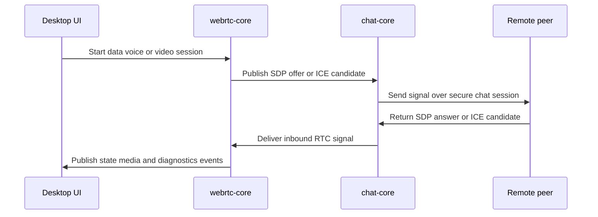

# WebRTC architecture in SecureLanSuite

This document describes the realtime layer built on top of the existing secure chat, discovery, and file-transfer stack.

## Current architecture

- `chat-core` transports realtime signaling envelopes over the already established secure chat connection.
- `webrtc-core` owns realtime session orchestration, session state, signaling handlers, diagnostics, media device enumeration, camera preview, and native `webrtc-java` runtime integration.
- `audio-core` and `webcam-core` currently provide runtime-facing media defaults and profile hints rather than a separate standalone transport stack.
- `desktop-client` surfaces realtime controls inside the messenger-style UI:
  - peer selection on the left
  - optional inline video stage plus chat/activity feed in the center
  - quick actions, voice/media status, transfers, RTC data tools, and diagnostics on the right

## What is supported now

### Stable / primary flows
- `RTCDataChannel` sessions
- voice sessions backed by native `webrtc-java`
- signaling exchange through the existing secure chat path
- realtime state and diagnostics in the desktop client
- microphone and camera capture device enumeration in the desktop UI
- microphone test flow

### Implemented but experimental flows
- camera preview window
- 1-to-1 video calls
- inline 1-to-1 video stage in the desktop client
- local and remote video frame propagation through runtime events
- preview conversion guards and diagnostics for video capture/frame conversion failures

Video-related controls exist in the current desktop UI, but video remains experimental until capture, preview, remote rendering, and device/runtime compatibility are stable enough for normal use.

## Runtime behavior

The default `RtcSessionService` creates a concrete `RtcEngine` through `RtcEngineProvider`.

Startup behavior:
- try to initialize a native `webrtc-java` engine
- fall back to `NoOpRtcEngine` only if native initialization fails

`WebRtcJavaEngine` currently provides:
- offer/answer negotiation through the existing secure chat signaling path
- trickle ICE candidate exchange over `chat-core`
- automatic `RTCDataChannel` creation for local outbound sessions
- microphone capture and playout through `AudioDeviceModule`
- audio level events for local and remote streams
- camera capture through `MediaDevices` + `VideoDeviceSource` + `VideoTrack`
- selected microphone/camera capture device IDs for RTC sessions
- remote track observation for audio/video state reporting
- diagnostic logging and preview conversion guards for video troubleshooting

## Desktop UX model

The current desktop UX is chat-first and voice-first, with experimental video available from the same peer workflow.

### Main workflow
1. start or connect to a secure chat session
2. discover LAN peers automatically or use manual host/port connection
3. select a peer from the left peer list
4. exchange messages in the center feed
5. trigger quick actions from the right panel:
   - send file
   - start voice
   - start experimental video
   - hang up

### Media controls
The right panel includes:
- microphone selector
- camera selector
- microphone test action
- camera test/preview action
- local and remote audio level indicators
- current audio/video profile hints

If no explicit capture device is selected, the runtime uses the default/first available device.

### Video preview flags
The desktop UI reads these JVM system properties:
- `securelan.rtc.videoPreview.local.enabled`
- `securelan.rtc.videoPreview.remote.enabled`

Both are currently enabled by default in the desktop client. They can be disabled when troubleshooting camera or frame conversion instability.

### Advanced / diagnostics section
The right panel also contains a place for:
- provider/runtime details
- diagnostics and debug status
- notes about preview stability and runtime toggles

## Signaling flow

## Diagnostics

The runtime exposes diagnostics for:
- native provider initialization status
- signaling and ICE progression
- selected/default audio capture devices
- detected cameras and selected video capability
- local/remote audio level events
- local/remote video frame events
- preview conversion failures
- camera preview session status
- runtime warnings and errors

## Current constraints

- audio output device selection is not exposed in the desktop UI yet
- video may still fail on some Windows/JDK/camera combinations
- the current desktop UX is an inline 1-to-1 video stage rather than a multi-peer conference grid
- the project currently prioritizes reliable text + discovery + file transfer + voice over a video-first experience
- chunked large file transfer over `RTCDataChannel` has not been implemented yet
- screen sharing is not implemented yet

## Recommended next steps

- stabilize video capture and remote rendering across more devices and JDK/runtime combinations
- expose manual audio output device selection if supported reliably by the runtime stack
- add safe experimental toggles for video preview and capture modes in the UI instead of only JVM properties
- add chunked transfer with backpressure awareness for `RTCDataChannel`
- add screen-sharing mode backed by desktop capture
- add cross-machine smoke checks for voice and video sessions
